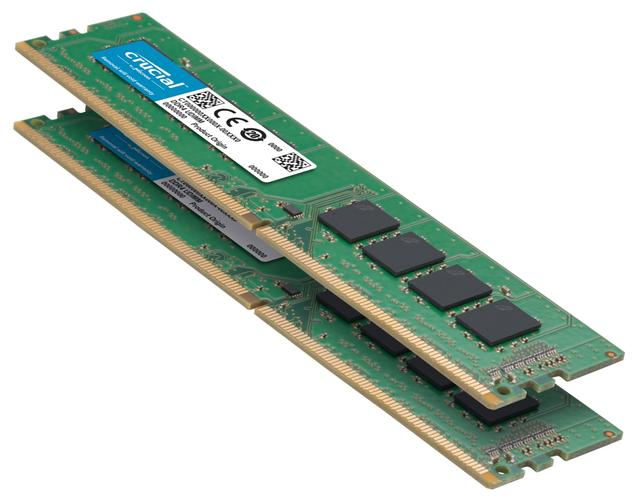
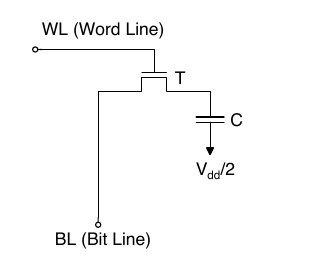
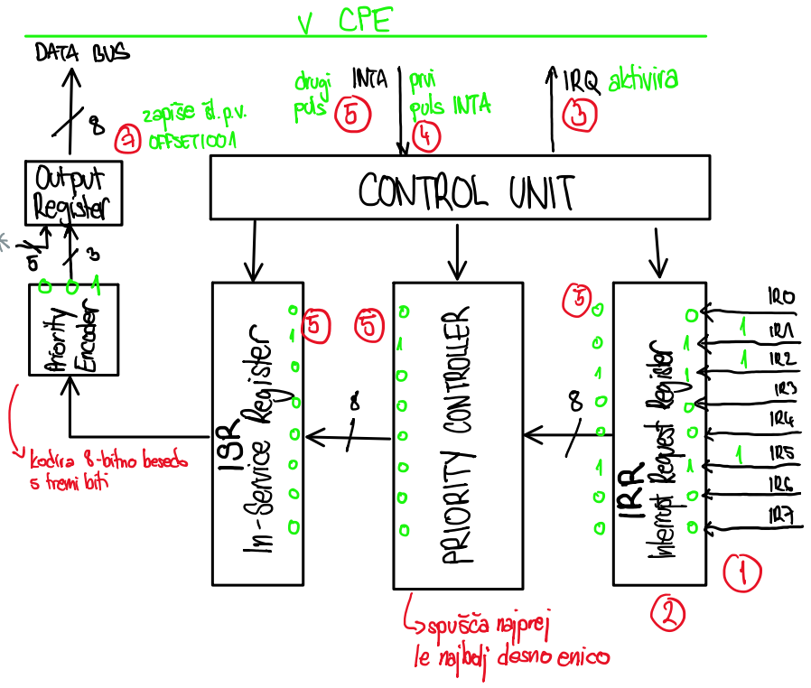
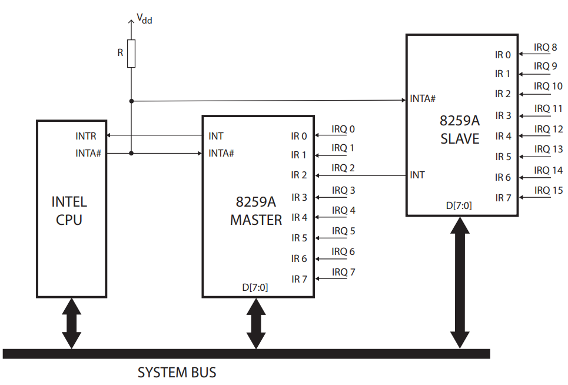
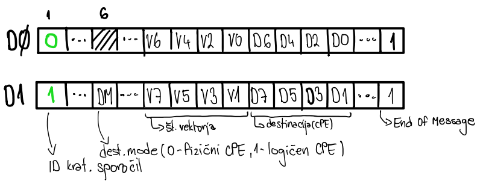
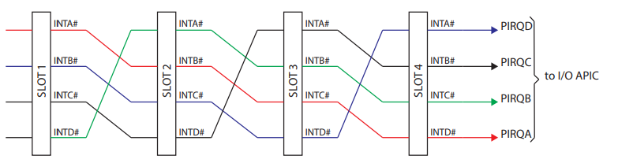
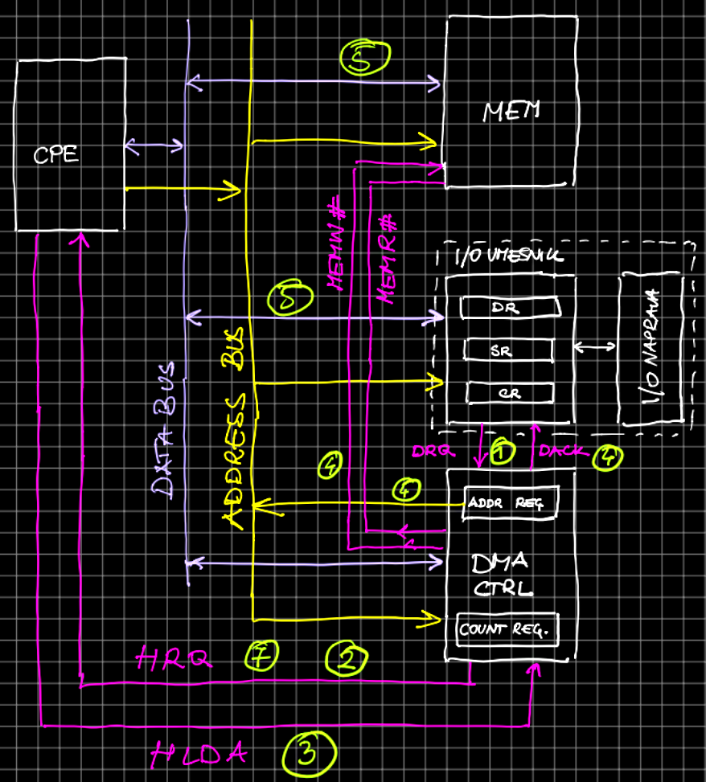
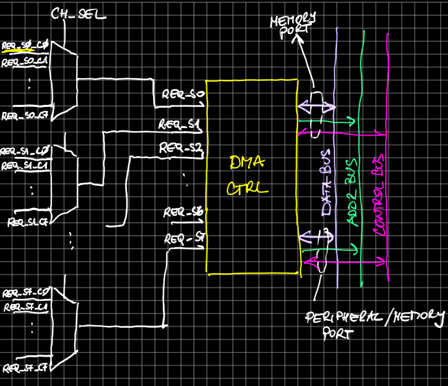
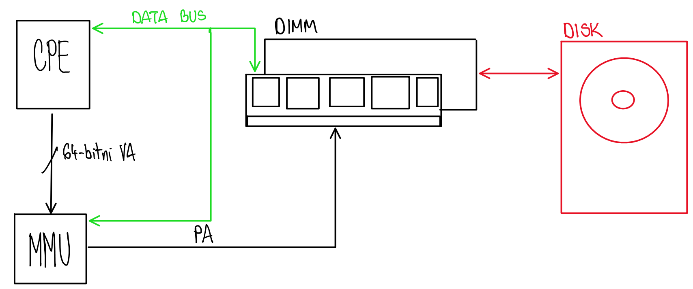

# ORS

## Odgovori na commonly postavljena ustna vprasanja pri predmetu ORS

### Kaj je banka v DRAM pomnilnikih? 
### Kaj je polje DRAM? Kako je organizirano?
### Zakaj imamo v polju DRMA celic dolge vrstice?
### Koliko polj DRAM vsebuje ena banka?
### Do katerih DRAM celic v DRAM banki dostopamo istočasno?
### Kako osvežujemo vsebino vsrtice v DRAM banki?
DRAM polje je sestavljeno iz **DRAM celic**. Branje in pisanje v celico poteka preko bitne linije (BL). Stanje se za razliko od SRAM celic ohrani v kondenzatorju (realiziran je z uporabo MOS celic). To naredi DRAM celico zelo uporabno, saj je ravno zaradi kondenzatorja veliko manjsa kot SRAM celica. Ker je kondenzator _nestabilen_ - pocasi izpraznjuje svoj naboj na bitno linijo, ga je potrebno regularno osvezevati. Branje iz DRAM celice je **destruktivno**, tako da vsakemu branju sledi pisanje.
Zaradi fizicnih lastnosti, je bitna linija v bistvu tudi nek kondenzator. Zaradi te lastnosti, pa morajo biti bitne linije nujno **kratke**. Do wordline-a pa dostopa naslovni dekodirnik, kateri da signal, naj kondenzator spusti svoj naboj na bitno linijo. 

DRAM polje, je v bistvu 2D array DRAM celic. Do naslova v DRAM polju dostopamo s parom indeksa vrstice in indeksa stolpca. Tipicna velikost DRAMA danes je 32k vrstic in 1024 stolpcev. Vsak DRAM cip ima lahko od 4-16 DRAM polj, do katerih lahk dostopa hkrati MCU. Mnozici teh polj, do katerih dostopamo recemo **banka**.

### Zakaj v polju DRAM celic vrstice niso dolge toliko kot je dolga ena pomnilniška beseda?
### Zakaj potrebujemo signala CAS# in RAS# ? Zakaja preprosto ne izstavimo naslova pomnilniške besede?
### Opišite dostop (bralni ali pisalni) do DRAM banke (časovno zaporedje naslovnih in kontrolnih signalov, časi, ..)
### Kaj sdo časi tRAS, tRDC, tRP, tRCin tCL?
### Kako je definiran čas dosatopa do vrstice tRC?
### Kako izboljšamo odzivnost DRAM pomnilnikov? Kaj je Fast Page Mode DRAM? Kaj pa EDO DRAM?
### Kakšne izboljšave prinaša SDRAM?
### Kaj je CAS latenca pri SDRAM-ih? Kako je pri SDRAM-ih definirana (določena)? 
### Kakšne so tipične vrednosti časov tRCD, tCL (CAS latency), tRP pri modernih SDRAM-ih? Ali jih lahko tehnološko skrajšamo in kako?
### Kaj je DDR? Kaj je 2n-prefetch? 
### Kaj so ukazi pri SDRAM-ih?
### Opišite dostop (pisalni ali bralni) do banke v SDRAM pomnilniku? 
### Kaj je eksplozijski prenos?  
### Kakšna je razlika med eksplozijskim prenosom in 2n-prefetchom? Ali lahko uporabomo oboje?
### Ali pri DDR(2,3,4) lahko opravimo eksplozijski dostop dolžine 1? 
### Opišite kako pohitrimo dostope pri DDR(2,3,4) v primerjavi s SDRAM-i?
### Kako se pri SDRAM-ih mapirajo naslovi iz CPE v naslove vrstice, stolpca, banke?
### Kaj je DIMM modul?
### Kaj je rank?
### Do koliko podatkov naenkrat dostopamo pri DDR(2,3,4) DIMM modulu?
### Kajh pomeniji čai podani kot npr. 9-9-9 pri DIMM modulih?
### Kaj pomeni PC4-19200 pri DDR4 DIMM modulih? 
### Kako je določena frkevnca ure na vodilu za DDR(2,3,4)?
### Kaj so kanali? Koliko kanalov podpirajo sodobni procesorji in njihovi pomnilniški krmilniki?
### Kako so kanali označeni na matičnih ploščah? 
### Predpostavite, da imate dva enaka DIMM modula? Kako jih boste vstavili v sockete na matični plošči? Zakaj?

## PREKINITVE

### Kaj so izjeme (prekinitve in pasti)?
Prekinitve so mehanizem s katerim zunanja naprava zahteva pozornost procesorja. Izvajanje trenutno izvajajočega programa se prekine in se prične izvajati prekinitveno servisni podprogram. Pasti so prekinitve ki jih aktivira sama CPE, pogosto kot rezultat ilegalne / napačne instrukcije, ali kdaj CPE poskusi izvesti ukaz ki ni mogoče pridobiti (*fetch-ati*).
### Kako se prožijo prekinitve?
Prekinitve se prožijo tako da naprava aktivira (nastavi napetost na vodilu na HIGH ali LOW odvisno od sistema) **IRQ** (*Interrupt Request*) vodilo, ter čaka na odgovor procesorja. Procesor preveri stanje IRQ pina/pinov vsakič preden se iz pomnilnika dobi novi ukaz, na katerega kaže programski števec. Če je IRQ vodilo aktivno, potem procesor začne z izvajanjem **Prekinitvenog servisnega podprograma** (*Interrupt Service Program*), ki se nahaja na nekem stalnem naslovu v pomnilniku. Procesor prvo izvede še vse ukaze v cevovodu, ki spreminjajo kontekst izvajajočega programa (registri, pomnilnik in zastavice), ter shrani na sklad vse pomembne registre (PC, SP, LR). CPE potem lahko sporoči potem **INTA** (*Interrupt acknowledge*) da je videl prekinitev in da naprava lahko umakne/deaktivira IRQ.
### Kaj je prekinitvena tabela?
Prekinitvnena (vektorska) tabela je seznam naslovov prekinitvenega servisnega programa za vsako od I/O naprav ki so povezane z CPE. Tabela je dolga toliko besed koliko je možno naprav povezati na CPE.
### Kako je organizirana prekinitvena tabela pri ARM Cortex M procesorjih?
ARM Cortex M / ARM9 procesorji uporabljajo vektorsko tabelo, pri kateri vsaki zapis je dolg 32 bita, kar ni dovolj da bi vsebovalo celotno kodo PSP-ja, vendar običajno vsebuje kazalec na pomnilniški naslov kjer je začetek PSP-a. Osnovna prekinitvena tabela vsebuje vektore *Reset, Undefined Instruction, Software Interrupt, Prefetch Abort, Data Abort, Interrupt Request* in *Fast Interrupt Request*. Tudi so shranjene prioritete posameznih prekinitvi, kje v osnovni tabeli *Reset* ima najvišjo prioriteto (1), ter *Undefined Instruction* in *Undefined Instruction* imata najnižjo (6).
### Kaj je prekinitveno servisni podprogram (interrupt handler)?
Prekinitveno servisni podprogram je program, ki CPE začne izvajati kot odgovor na prekinitveno zahtevo I/O naprave.
### Kako CPE pridobi naslov PSP?
Če imamo samo eno I/O napravo, je izbran en fiksen naslov za PSP, ter na temu mestu hranimo naslov začetka PSP-ja. Če imamo več naprav, uporabljamo prekinitveno tabelo. Pri ARM CPE, vsaka naprava ima svoj IRQ pin, ter v pomnilniku se napravi dodeli ena ena pomnilniška beseda na fiksnem naslovu, ki hrani naslov PSP-ja za napravo. Intel/x86 CPE pričakuje da mu naprava ki prekinja sporoči številko prekinitvenega vektorja `[0, 255]`, ki se uporablja kot indeks v tabeli prekinitvenih vektorjev. Indeksi `[0, 31]` so rezervirane za prekinitve in pasti iz CPE, ostale pa se dodeljujejo V/I napravam.
### Kaj je prekinitveni krmilnik in zakaj ga potrebujemo?
Prekinitveni krmilnik je naprava ki združi vse zunanje zahteve za prekinitve v eno CPE IRQ vodilo, ter jim določi prioriteto (v katerem vrstnem redu bo se CPE obravnaval z njimi), usmerja zahteve CPE-i, ter informira CPE o temu katera naprava zahteva prekinitev in prekinitveni vektor naprave, kako CPE ne rabi *poll*-ati I/O naprave.
### Opišite delovanje prekinitvenega krmilnika Intel 8259A.
Intel PIC8259A deluje tako da I/O naprava aktivira pripadajoči IR vhod na krmilniku. Če več naprav naenkrat zahtevajo prekinitev, PIC8259A izbere tisto zahtevo z najvišjo prioriteto (IR0 = največja, IR7 = najmanjša), ter aktivira IRQ na vodilu CPE. CPE ko vidi aktiven IRQ, dokonča z izvajanjem ukazov v cevovodu, ter shrani kontekst. PIC medtem iz **IRR** (*Internal Request Register*) prepiše najbolj desno enico v **ISR** (*In-Service Register*) in je hkrati pobriše iz IRR. 

CPE aktiviranjem INTA v trajanju 2 urini periodi sporoči PIC-u da je videla zahtevo. PIC interno pripravi številko prekinitvenega vektorja, ter po drugem INTA pulsu CPE-a, PIC na podatkovno vodilo postavi številko prekinitvenega vektorja: OFFSET (zgornjih 5b - če je samo en PIC uporabljamo offset `00100` <-> `32`) ter mesto enice v ISR (spodnjih 3b).

### Kako bi s prekinitvenim krmilnikom 8259A servisirali več kot 8 prekinitvenih zahtev (kanalov)?
S PIC8259A lahko servisiramo več kot 8 prekinitvenih zahtev z uporabo **kaskadne povezave PIC-ov**, kjer imamo en *master* PIC, ter do 8 *slave* PIC-ov. Ponavadi so računalniki uporabljali samo 2 PIC-a: en master in en slave.

### Opišite kaskadno vezavo prekinitvenih krmilnikov 8259A.
PIC8259A dopušča kaskadno povezovanje, ter se ponavadi uporabljalo 2 PIC-a: en master in en slave. Offseti posameznih PIC-ov so bili programibilni, ter so se upisovali pri init-u. Master PIC ima offset `00100`, ter je pokrival IRQ zahteve I/O naprav med indeksima `32` in `39`. Slave PIC ima pa offset `00101`, in pokriva naprave med `40` in `47`. IRQ/INT slave-a se ponavadi vezuje na IR2 master PIC-a. Takrat ko naprava na slave PIC-u aktivira IRQ, ter potem master PIC-a to posreduje CPE. INTA od CPE vidita tudi master in slave PIC, vendar master PIC to ignorira ker je naslovljeno na `00100010` - slave PIC. Slave PIC gre skozi vse faze navadnega PIC-a in po drugemu INTA od CPE na vodilo postavi številko prekinitvenega vektorja, z offsetom `00101`. 
### Kaj je osnova ideja pri APIC? 
Osnovna ideja APIC-a je da omogoči uravnotežen način naložitve prekinitvenih zahtev na večje število CPE. 
### Opišite vlogo LAPIC in I/O APIC?
Vsaki CPE ima svoj lokalni PIC, katerima I/O APIC uravnoteženo posreduje prekinitve. Za CPE je LAPIC identičen PIC8259A.
### Kaj je APIC vodilo? Čemu je namenjeno?
APIC vodilo je 3-bitno serijsko vodilo po katerem I/O APIC sporoča katerega od LAPIC-ov želi ustaviti in kdo ga ustavlja.
### Opišite delovanje IO APIC krmilnika.
I/O APIC posreduje med prekinitvenim zahtevama ISA (16 vhodov) in PCI (8 vhodov) napravah. Ob prekinitveni zahtevi prebere pripadajoči vnos v **IRT** (*Interrupt Redirection Table*, vsebuje 24 64-bitna vnosa, kateri hrane številko vektorja, številko CPE kateri se pošlje prekinitvena zahteva in prioriteto) iz katere tvori 21-bitno APIC sporočilo, ki ga pošlje po 3-bitnem vodilu (CLK, APICD0 in APICD1). Sporočilo se pošlje kot 2x21 bitov.

### Kaj je to preusmeritvena tabela v I/O APIC (redirection table)? 
*Interrupt Redirection Table* (IRT, prekinitvena preusmeritvena tabela) je tabela ki vsebuje 24 (en za vsaki INT pin) 64-bitna vnosa, kateri hrane številko vektorja, številko CPE kateri se pošlje prekinitvena zahteva in prioriteto.
### Kaj so to PCI prekinitve? Kako si PCI naprave delijo prekinitvene signale?
PCI prekinitve so prekinitve katere zahtevajo PCI naprave. Bodoči da je bilo predvideno da sistem lahko ima največ 4 PCI naprave, APIC ima samo 8 prostih vhodov, kar pomeni da če PCI naprave imajo več kot 8 funkcij pride do zmanjkovanja vhodov. Rešitev je da se prekinitve iz PCI naprav prožijo na nivo (*level triggered*), kar pomeni da si več PCI naprav medsobno deli eno prekinitveno linijo. Kdo je prekinil se pa ugotovi s programskim izpraševanjem (polling). Posledično se na APIC-u dodeli le 4 vhode vsem PCI napravam/funkcijam:
`INT 16 == PIRQA`, `INT 17 == PIRQB`, `INT 18 == PIRQC`, `INT 19 == PIRQD` (**PIR** - *PCI Interrupts Routing*). Ponavadi se uporablja *round-robin* princip vezave - na PIRQA vežemo INT A iz prve, INT B iz druge, INT C iz tretje in INT D iz četvrte naprave in tako naprej.
### Kam se vežejo PCI prekinitveni signali PIRQA - PIRQD na IO APIC?
PIRQA-PIRQD se vežejo na INT pine 16-23 I/O APIC-a.
### Kako je pametno povezati INTA-INTD signale med posameznimi PCI napravami? 
Po *round-robin* principu vezave - na PIRQA vežemo INT A iz prve, INT B iz druge, INT C iz tretje in INT D iz četvrte naprave in tako naprej.

### Predpostavite, da v sistem želite vstaviti neko PCI kartico. Kako boste izbrali na katerem vhodu (PIRQA-PIRQD) bo prožila prekinitve?
Odvisno od prioritete naprave, PIRQA bi dodelili najbolj pomembni napravi, PIRQD pa najmanj pomemnbo napravo.
### Kaj so to MSI prekinitve?
**MSI** (*Message Signalled Interrupts*) prekinitve so prekinitve ki uporablajajo sporočila za pisalne tranzakcije na vodilu. Sporočilo se piše na prej definiran naslov, ter vsebuje naslov LAPIC-a in prekinitveni vektor. Pojavil se je z uvodom PCIe standarda leta 2004, ter je počasi umaknil I/O APIC. Prednosti so da več ne rabimo INT A - INT D žic, ni več deljenja PIRQ žic, ni več *pollinga* in ni več problema prekinitev med pisanjem v RAM.
### Zakaj potrebujemo DMA krmilnike? Kako bi bilo brez njih?
Brez DMA (*Direct Memory Access*) krmilnikov bi morale PCI naprave pisati podatke v RAM preko CPE, kar ni učinkovito, ker bremeni CPE. uporablja se le v manjših vgrajenih sistemih.
### Kakšna je razlika med fly-by in fly through DMA krmilnik? Navedite dva realna primera.
**Fly-by DMA krmilnik** - podatki se prenašajo mimo DMA kontrolerja, CPE in kontroler se dogovorita kdo bo pisal na naslovno vodilo. Ne omogoča direktno MEM<>MEM prenosa, za to bi potrebovali dva Fly-by krmilnika (primer: Intel 8237A)

**Fly-through DMA krmilnik** - podatki grejo skozi DMA krmilnik, ki jih hrani v FIFO vrstah, ki omogoča MEM<>MEM prenos. Potrebujemo dva pomnilniška dostopa (branje in pisanje) (primer: STM32Fx)
### Opišite delovanje 8237A DMA krmilnika.
Je tipa »Fly-by«, ker podatki letijo mimo njega in potrebuje le en cikel na vodilu. Naslov na vodilu se vedno nanaša na pomnilnik, napravo se »izbere« s pomočjo DRQ/DACK signala. Pred samim prenosom mora CPE nastaviti vrednosti ADDR registra in COUNT registra v DMA krmilniku.Temu pravimo inicializacija DMA krmilnika.
1. V/I naprava ima nov podatek za v MEM. Zahteva DMA prenos tako, da aktivira DRQ.
2. DMA zahteva vodilo tako, da postavi HRQ. S tem pove CPE, da se čimprej umakne iz vodila(vse
svoje priključke postavi v visoko impedančno stanje).
3. CPE zaključi svoje prenose in sporoči DMA krmilniku, da je vodilo prosto – HLDA.
4. DMA krmilnik postavi naslov na vodilo in aktivira signala MEMW#(pišemo iz naprave na vodilo) in DACK(pove napravi, ki je zahtevala prenos, da podatke iz svojega DATA registra postavi na vodilo).

    a. V tem koraku se naslovita pomnilnik(iz ADDR registra) in V/I naprava(DACK)!

    b. Naslov na vodilu pri DMA prenosu s takim krmilnikom se vedno nanaša na pomnilnik!
5. Zdaj so podatki na vodilu in se pišejo v MEM.
6. DMA krmilnik zmanjša vrednost v COUNT registru. Če je COUNT register == 0 se prenos zaključi.
7. DMA krmilnik deaktivira HRQ.
8. CPE deaktivira HACK.

### Opišite delovanje DMA krmilnika v sistemih STM32F4.
Je tipa »Fly-through«. Vsak DMA prenos se definira z izvornim in ciljnim naslovom in vsak tok ima par registrov za shranjevanje teh naslovov(Peripheral Address Register – SxPAR in Memory Address Register – SxMAR). Vsak tok ima tudi shranjeno velikost(Number of Data Register - SxNDR) in tip prenosa.

Omogoča dva tipa prenosov: normalni(prenese enkrat in konča) in krožni(konstantno prenaša podatke iz lokacije na lokacijo).

Omogoča dva načina delovanja: da po prenosu poveča izvorni in ponorni kazalec(prenašanje tabel/polj) ali pa ne.

Arbiter izbira kateri tok je aktiven(prioriteta).

Port je v bistvu podatkovno + naslovno + kontrolno(kontrolni signali) vodilo.

Najprej se postavi izvorni naslov na naslovno vodilo, nato se prebere podatke iz izvora v interne FIFO vrste, nato se na naslovno vodilo postavi ciljni naslov in se podatki zapišejo iz FIFO vrst v cilj.

Torej omogoča `8 ∗ 8 = 64` I/O naprav. Naprava se najprej določi s CH_SEL nato pa interno z arbiterjem.

Ni DACK signalov, le DRQ(to so REQ_SX_CX) ampak jih tudi ne potrebujemo, ker imamo 2 porta se najprej naslovi prva nato pa druga naprava(MEM) ne obe hkrati.

### Kaj je DMA kanal?
Kanal je par DRQ/DACQ signalov. Vsak par signalov je vezan na smer prenosa. Torej lahko imamo 4 naprave, ki lahko samo pišejo oz. berejo iz MEM. Ali pa dve napravi, ki lahko pišeta in bereta v/iz MEM.

### Na koga se nanaša naslov, ki ga izstavi fly-by DMA krmilnik?
Vedno na pomnilnik. Sama naprava se »izbere« s pomočjo DRQ/DACK signala.

### Predpostavite, da želite iz V/I naprave prenašati v pomnilnik. Opištite DMA prenos ter vse sodelujoče signale za 8237A. 
Podobno odgovoru za vprašanje [**Opišite delovanje 8237A DMA krmilnika.**](#opišite-delovanje-8237a-dma-krmilnika.)

### Kakšna razlika je med tokom (stream) in kanalom pri DMA krmilniku v STM32F'.
Tok je aktiven DMA prenos med napravo in pomnilnik oz. pomnilnikom in pomnilnikom. En tok ima 8 kanalov(REQ_STR0_CH0 – 7). Imamo 8 tokov. Vsak kanal pripada eni I/O napravi.

### Opišite inicializacijo DMA krmilnika. Kaj je vse treba nastaviti pred začetkom prenosa?
Preden lahko pride do kakršnegakoli prenosa mora CPE inicializirati naslov DMA krmilnika in COUNT registre. CPE zapiše naslov iz kje/kam se bodo podatki prenesli v naslovni register in število podatkov(besed) v count register
### Kako DMA krmilnik obvesti CPE, da je prenos zaključen?
DMA med prenosom inkrementira ali dekrementira COUNT register(odvisno od nastavitve), ko ta pride do ciljnega števila, DMA krmilnik sproži END signal. Ta signal je po navadi vezan na interrupt pin CPE, ki sproži prekinitev ob koncu prenosa.

### Kaj je to bus mastering?
Naprava, ki izvaja prenos na vodilu je gospodar vodila – CPE ali DMA. Z evolucijo vodil(PCIe) naj bi lahko vsaka naprava (*PCIe Endpoint*) na PCIe vodilu sama dostopala do pomnilnika. To pomeni, da bi vsaka naprava imela vgrajeno DMA funkcionalnost. To pa pomeni, da bi lahko bila vsaka taka naprava gospodar vodila.

### Kaj je to navidezni pomnilnik? Zakaj ga imamo?
Navidzeni pomnilnik je način naslavljanja pomnilnika tako da vsak uporabnik ali program vidi ves pomnilnik kot svoj. Program / uporabnik lahko piše na katerkoli naslov ki hoče in **MMU** (*Memory Managment Unit*) skrbi za to da se ta navidezni naslov lahko preslika v fizični naslov v fizičnem pomnilniku. Navidezni pomnilnik nam omogoča da so programi pozicijsko in prostorno neodvisni, ter da nimamo omejitev števila programov, ki se izvajajo.

### Kaj je stran in kaj je okvir?
Stran (*page*) je blok v navideznem naslovnem prostoru (navideznem pomnilniku).

Okvir (*frame*) je blok v fizičnem naslovnem prostoru (fizičnem pomnilniku).
### Kako velika naj bo stran?
Strani so po navadi velike 4kB. To je neka sredina med tem, da imamo zelo majhne strani in zato veliko tabelo strani, vendar manj brezvezno porabljenega prostora in tem, da imamo zelo velike strani in veliko brezvezno porabljenega navideznega prostora, vendar manj overhead-a pri
branju/pisanju.
### Kaj je napaka strani?
*Page fault* – ko program poskuša dostopati do navideznega naslova, ki ni v fizičnem pomnilniku.
### Kaj je deskriptor strani?
Je vnos v tabeli strani, ki vsebuje zastavice **PVD** (*Present, Valid, Dirty*), **RWX** (*Read, Write, eXecute*) in naslov oz. številko okvirja. Če tej številki okvirja pripnemo odmik iz navideznega naslova, dobimo fizični naslov.
### Kaj vsebuje tabela strani?
Tabela strani vsebuje deskriptorje strani.
### Opišite večnivojsko ostranjevanje?
S tem rešujemo problem prevelike tabele strani. Tabelo strani razsekajmo na enako velike kose. Ti kosi naj bodo tako veliki kot je velika 1 stran (4KB). Potrebujemo še eno »korensko« tabelo strani, ki hrani naslove vseh listov. V RAM-u hranimo samo korensko tabelo in podtabelo, ki jo uporabljamo.
### Najmanj koliko tabel strani moramo hraniti v pomnilniku pri 2(3,4, ..)-nivojskem ostranjevanju?
Hraniti moramo najmanj toliko tabel kot imamo nivojev (korensko + eno za vsaki nivo).

### Kako pohitrimo preslikovanje navideznih naslovov?
V MMU hranimo manjšo tabelo, ki bo služila kot predpomnilnik za tabelo strani. Tako bomo izkoriščali veliko časovno lokalnost. Zadošča da hranimo le nekaj deskriptorjev (cca. 8). Temu pravimo preslikovalni predpomnilnik (asociativen SRAM v MMU enoti) oz. **TLB** (*Translation Look-aside Buffer*).

### Kaj je TLB? Kako je organiziran? Kako je velik?
**TLB** (*Translation Look-aside Buffer*) je tabela ki se nahaja v MMU enoti, ima prostora za cca. 8 deskriptorjev in deluje kot asociativni predpomnilnik. Izkorišča časovno lokalnost in verjetnost zadetka (hit rate) je 99%. 

### Zakaj zadošča tako mali TLB? Na kaj se zanašamo?
Zanašamo se na časovno lokalnost.

### Kako preslikujemo naslove v prisotnosti predpomnilnika?
Pomnilnik indeksiramo z navideznimi naslovi (VA) in tagiramo s fizičnimi naslovi (PA). Tej tehniki pravimo **VIPT** (*Virtually Indexed Physically Tagged*).

- Dovolimo, da se več istih VA preslika v isti blok/set v PP vendar če jih hočemo ločiti moramo pridobiti fizični tag.

- Posledično za indeks PP smemo uporabiti le tisti del navideznega naslova, ki se ne spreminja, to pa je spodnjih P bitov. To pomeni, da je PP lahko velik največ `2^p` besed. To pa je premalo, kako to popraviti?

    - Namesto direktnega PP uporabimo set-asociativni.
        - Velikost SA `PP ≤ 2^p∗ 𝑠𝑡𝑜𝑝𝑛𝑗𝑎 𝑎𝑠𝑜𝑐𝑖𝑎𝑡𝑖𝑣𝑛𝑜𝑠𝑡𝑖`
        - Če je stopnja = 4, p = 12, potem L1 PP ≤ 32𝑘𝐵
        - Če je stopnja = 8, p = 12, potem L1 PP ≤ 64𝑘𝐵
- Tisti del, ki se preslikuje pa se bo preslikal skozi TLB in dobili bomo fizični tag za PP

### Zakaj ni dobro, da v predpomnilnik gremo z navideznim naslovom? Zakaj pa bi bilo to dobro?
Ne moremo iskati samo z navideznim naslovom, saj se lahko isti navidezni naslov preslika v več različnih fizičnih naslovov(homonimi) – npr. če imamo več procesov, ne moremo ločiti kateremu procesu pripada posamezen fizični naslov in bomo lahko dostopali do napačnih podatkov. To bi bilo dobro, ker bi ne bi bilo potrebno nič dodatnega dela, saj CPE operira z navideznimi naslovi, ki jih MMU nato mora preslikat v fizične.

### Kako sme biti velika stran ob prisotnosti predpomnilnika? Zakaj?
 
2p besed, ker se le spodnjih p bitov v navideznem naslovu ne spreminja. S stranmi operiramo kot atomarnimi enotami – ne moremo jih naprej deliti in zato jih sploh ne bi mogli prenesti v predpomnilnik če bi bile večje.

## Summaries taken from ors book

>A SRAM cell uses a bistable element to store one bit of information. It is
made up of a bistable and two access nMOS transistors that serve as a switch
used to control the state of the bistable element during the read and write
operations.
Due to the ability to store the information indefinitely and the high speed of
SRAM cells, they are used to implement caches and registers in micropro
cessors. 

>Dynamic Random Access Memory (DRAM) is the main memory used for
all computers. DRAMs store their contents as a charge on a capacitor. A
DRAM cell consists only of a storage capacitor and a single nMOS transis
tor that acts as a switch between the storage capacitor and the bit line.
Reading from a DRAM cell is a destructive operation. Besides, the charge
on the capacitor leaks away through switched off transistor in tens to hun
dreds of milliseconds. Thus DRAMs should be regularly refreshed.
A sense amplifier is a special circuit used to detect the tiny voltage swing on
the bit line and read the data. The sense amplifier is also used to write back
the bit value to the storage cell. This operation is referred to as precharge. 

>DRAM is arranged in a rectangular memory array of storage cells organized
into rows and columns.
The cells of a DRAM are accessed by a row address and a column address.
A bank is a set of N memory arrays accessed simultaneously, forming an
N-bit width column. Usually, there are 4, 8, or 16 DRAM arrays in a bank.

>DRAM chips contain at least one memory bank. The row address decoder
is used to activate the appropriate word line from the given row address. The
column selector is used to select the proper column from the given column
address.
As the number of address bits required to select rows and columns can be
quite large, the address lines are multiplexed. To indicate which of two ad-
dresses is currently on the bus, we need two additional control signals: the
row access strobe (RAS) and the column access strobe (CAS).
The write enable (WE) signal is used to choose a read or a write operation.
During a read operation, the output enable (OE) signal is used to prevent
data from appearing at the output until needed.
