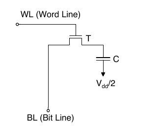
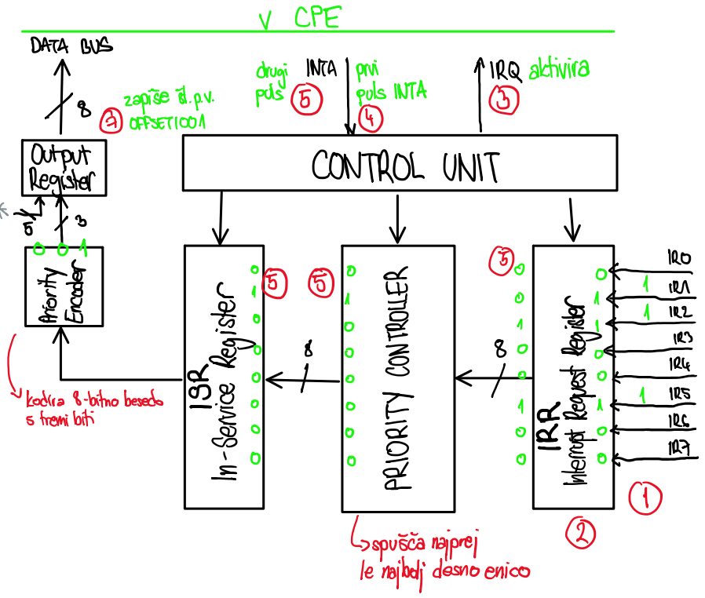
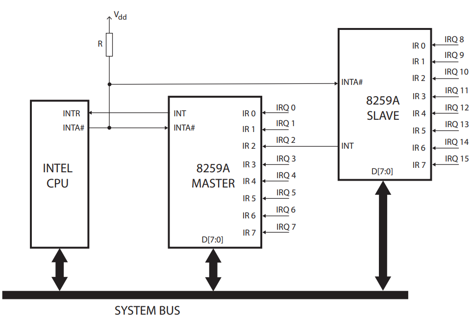
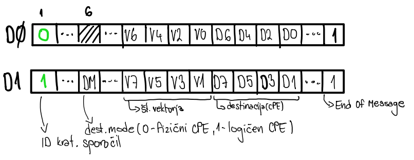
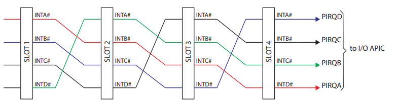
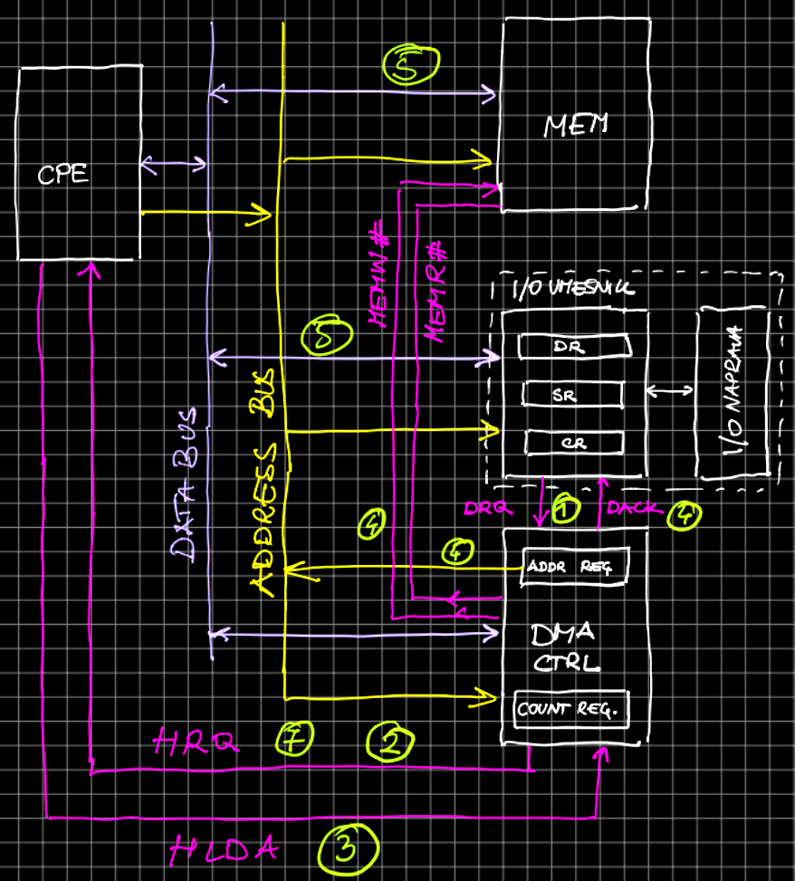
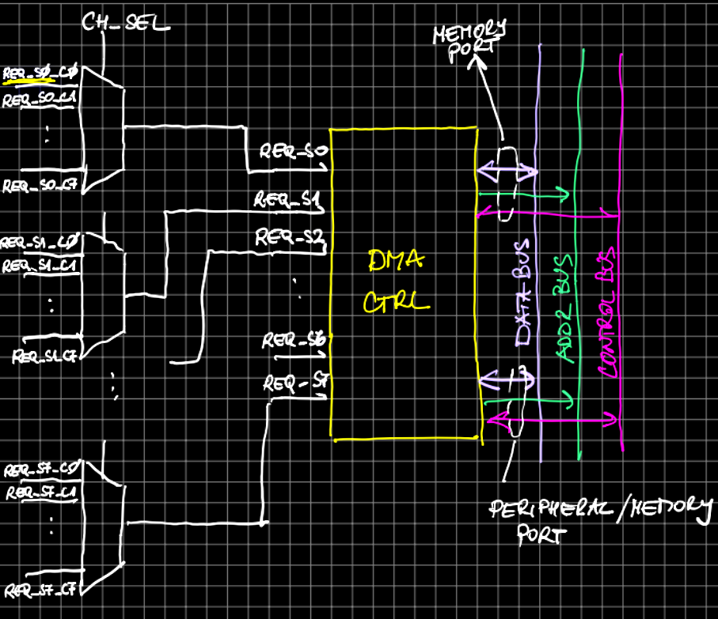
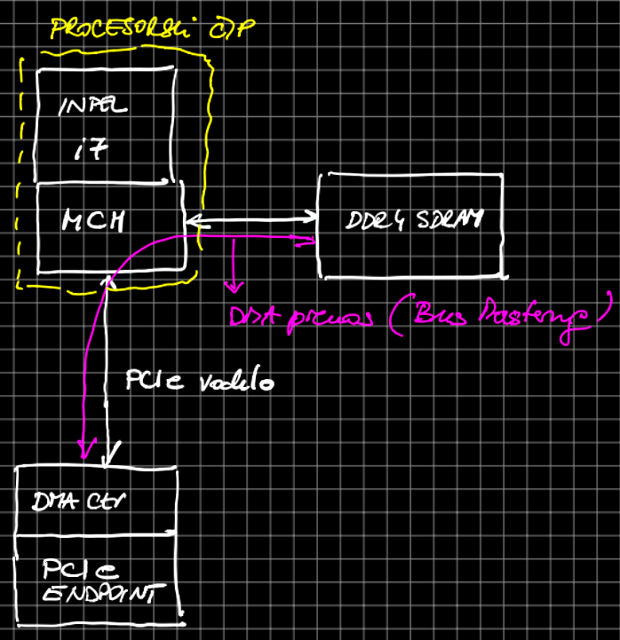
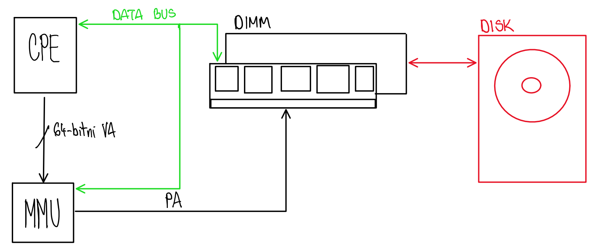

# ORS

## Odgovori na commonly postavljena ustna vprasanja pri predmetu ORS

## DRAM

### Kaj je banka v DRAM pomnilnikih?

### Kaj je polje DRAM? Kako je organizirano?

### Zakaj imamo v polju DRAM celic dolge vrstice?

### Koliko polj DRAM vsebuje ena banka?

### Do katerih DRAM celic v DRAM banki dostopamo istočasno?

### Zakaj v polju DRAM celic vrstice niso dolge toliko, kot je dolga ena pomnilniška beseda?

### Zakaj potrebujemo signala CAS# in RAS#? Zakaj preprosto ne izstavimo naslova pomnilniške besede?

### Kaj so časi tRAS, tRDC, tRP, tRCin tCL?

### Kako je definiran čas dostopa do vrstice tRC?

Vsi ti odgovori so podani v spodnjem spisku:

DRAM polje je sestavljeno iz **DRAM celic**. Branje in pisanje v celico poteka preko bitne linije (BL). Stanje se za razliko od SRAM celic ohrani v kondenzatorju (realiziran je z uporabo MOS celic). To naredi DRAM celico zelo uporabno, saj je ravno zaradi kondenzatorja veliko manjša kot SRAM celica. Ker je kondenzator _nestabilen_ - počasi izpraznjuje svoj naboj na bitno linijo - ga je potrebno regularno osveževati. Branje iz DRAM celice je **destruktivno**, zato vsakemu branju sledi pisanje.
Zaradi fizičnih lastnosti je bitna linija v bistvu tudi nek kondenzator. Zaradi te lastnosti pa morajo biti bitne linije nujno **kratke**. Do wordline-a pa dostopa naslovni dekodirnik, ki da signal, naj kondenzator spusti svoj naboj na bitno linijo.



DRAM polje je v bistvu 2D array DRAM celic. Do naslova v DRAM polju dostopamo s parom indeksa vrstice in indeksa stolpca. Tipična velikost DRAMA danes je 32k vrstic in 1024 stolpcev. Vsak DRAM čip ima lahko od 4-16 DRAM polj, do katerih lahko dostopa hkrati MCU. Množici teh polj, do katerih dostopamo, rečemo **banka**.


### Zakaj v polju DRAM celic vrstice niso dolge toliko, kot je dolga ena pomnilniška beseda?

Ker se do RAM-a dostopa v primeru zgrešitve v predpomnilniku, posledično pa se v RAM in iz njega prenaša za en predpomnilniški blok podatkov, kar je po navadi več kot ena pomnilniška beseda naenkrat...

### Zakaj potrebujemo signala CAS# in RAS#? Zakaj preprosto ne izstavimo naslova pomnilniške besede?

Ker je naslovni prostor vrstic in stolpcev precej velik (32k vrstic), so naslovne linije multipleksirane. Zato za izbiro stolpca in vrstice uvedemo dva nova signala -> CAS(_Column access strobe_) in RAS (_Row access strobe_). Uvedemo tudi WE(_write enable_) signal, s katerim izberemo, ali bomo pisali ali brali. Med branjem nam pride prav tudi OE(_Output enable signal_), s katerim omejimo pretok podatka na bitno linijo, dokler nismo pripravljeni na sprejem podatka. Vsi tej signali so _active low_, kar pomeni, da so aktivni, ko je na njih logična ničla.


### Opišite dostop (bralni ali pisalni) do DRAM banke (časovno zaporedje naslovnih in kontrolnih signalov, časi, ...)

### Branje

Za branje potrebujemo najprej izbrati celico, ki jo bomo brali z dvema signaloma RAS in CAS. Nato pa ta signal zazna tipalni ojačevalnik in pošlje podatke na izhodne pine. Postopek branja:

- Najprej naslovimo vrstico na naslovnih pinih.
- Nato se sproži RAS signal (_active low_), ki traja vnaprej določen čas **tRAS**. Ko je aktiven RAS signal, vse celice v vrstici zacnejo spuščati bite na bitno linijo.
- Nato naslovimo še stolpce.
- Pred aktivacijo CAS signala je potrebno aktivirati še WE signal (_postavimo ga na visoko_).
- Po predpisanem času **tRCD** aktiviramo še CAS signal (_active low_), ki ostane aktiviran **tCAS** časa. _RAS-to-CAS_ zakasnitev nam zagotavlja, da se bo podatek pravilno zaznal na tipalnih ojačevalnikih.
- Podatki se pojavijo na izhodnih pinih pomnilniške naprave. Pojavijo se po času **tCL**.
- Preden lahko rečemo, da smo uspešno prebrali podatke, moramo še zagotoviti, da se deaktivirata RAS in CAS signala. Šele nato se lahko izvede novo branje, po **tRP** (_row precharge_) času.

En cikel branja traja: **tRC = tRAS + tRP**.

### Pisanje

Za pisanje potrebujemo najprej izbrati celico, ki jo bomo brali z dvema signaloma RAS in CAS, ter na vhodne pine napisati podatke, ki jih želimo pisati. Nato tipalni ojačevalnik napolni oz. izprazni kondenzatorje v izbranih celicah (_odvisno od vhoda, logicna 0 ali 1_). Postopek pisanja:

- Najprej naslovimo vrstico na naslovnih pinih.
- Nato se sproži RAS signal (_active low_), traja vnaprej določen čas **tRAS**. Ko je aktiven RAS signal, se vrstice odprejo.
- Zdaj se morajo podatki pojaviti na vhodnih pinih.
- Po podatkih moramo še nasloviti stolpce.
- Nato se postavi **WE** na **active low**.
- Po predpisanem času **tRCD** se vključi CAS signal(_active low_), ki ostane odprt **tCAS** časa.
- Tipalni ojačevalniki zapišejo podatke.
- Preden lahko rečemo, da smo uspešno prebrali oziroma zapisali, moramo še zagotoviti, da se deaktivirata RAS in CAS signala. Šele nato se lahko izvede novo branje, po tRP (row precharge) času.

Cikel pisanja traja ravno toliko časa kot cikel branja.

### Kako osvežujemo vsebino vsrtice v DRAM banki?

Ker so celice zgrajene iz kondenzatorjev, ki _leakajo_ (puščajo elektrone), jih je potrebno intervalno osveževati vrstico po vrstico. To se na modernih RAM sistemih dogaja na približno 64 ms. Frekvenca osveževanja na DRAM modulih je določena s pomočjo internega oscilatorja in števca, ki indicira, katero vrstico je potrebno osvežiti.
Za osveževanje je uporabljena metoda _CAS-before-RAS refresh_. Koraki:

- CAS signal postavimo v nizko stanje, WE signal pa ostane v visokem stanju (ekvivalentno branju).
- Po določenem delay-u RAS preklopimo v nizko stanje.
- Interni števec določi, katero vrstico je potrebno osvežiti, in naslovi določene stolpce.
- Po določenem delay-u CAS vrnemo v visoko stanje.
- Po določenem delay-u RAS vrnemo v visoko stanje.

### Summary: Important timings in DRAMs

| Name                                | Symbol | Description                                                                                                                                                                   |
| ----------------------------------- | ------ | ----------------------------------------------------------------------------------------------------------------------------------------------------------------------------- |
| Row Active Time                     | tRAS   | The minimum amount of time RAS is required to be active (low) to read or write to a memory location.                                                                          |
| CAS latency                         | tCL    | This is the time interval it takes to read the first bit of memory from a DRAM with the correct row already open.                                                             |
| Row Address to Column Address Delay | tRCD   | The minimum time required between activating RAS and activating CAS . It is the time interval between row access and data ready at sense amplifiers.                          |
| Random Access Time                  | tRAC   | This is the time required to read any random memory cell. It is the time to read the first bit of memory from an DRAM without an active row. tRAC = tRCD + tCL.               |
| Row Precharge Time                  | tRP    | After a successful data retrieval from the memory, the row that was used to access the data needs to be closed. This is the minimum amount of time that RAS must be inactive. |
| Row Cycle Time                      | tRC    | This is the time associated with single rad or write cycle. tRC = tRAS + tRP                                                                                                  |

This table is taken from the ors book.

### Kako izboljšamo odzivnost DRAM pomnilnikov? Kaj je Fast Page Mode DRAM? Kaj pa EDO DRAM?

Fast page mode DRAM - eliminira potrebo po ponovnem naslavljanju vrstice, če je že bila odprta v predhodnem branju. Tako potrebujemo nasloviti samo določene stolpce --> eliminiramo RAS signal in lahko na hitro preberemo še ostale sosednje stolpce. Vrstico osvežimo šele, ko želimo brati neke podatke, ki niso v isti vrstici (do tedaj so vrednosti shranjene v SRAM celicah na koncu tipalnih ojačevalnikov).

EDO RAM - Dovoljuje, da podatki ostanejo na izhodnih pinih brez čakanja, da se ti podatki najprej preberejo [?]. Tako se lahko prej izvede naslednji cikel.

### Opišite dostop (pisalni ali bralni) do banke v SDRAM pomnilniku.

### Kakšne izboljšave prinaša SDRAM?

Vse operacije (odpiranje vrstice, naslavljanje stolpca, zapiranje vrstice) so sinhronizirane z interno uro. Gre za končni avtomat, ki proži te signale na določene urine fronte. Bank je pri SDRAMIh več (2-16), kar nam omogoča prepletanje bank, npr. medtem ko iz ene banke beremo, lahko drugo banko osvežujemo. Ali pa ko dostopamo v eni banki do vrstice `i` in do stolpca `j`, lahko v drugi banki odpremo vstico `i` in stolpec `j+1`.
Dodana sta tudi dva nova registra, data input register in data output register, v katerih lahko začasno shranimo prebrane oz. tiste bite, ki jih želimo zapisati v SDRAM.
Cevovodenje READ/WRITE/PRECHARGE ukazov.

### Kaj so ukazi pri SDRAM-ih?

Potek izvajanja ukazov v SDRAM:

- ACTIVE + naslov vrstice na A vodilo + naslov banke (odpiranje vrstice) </br>
  CS-0,
  WE-1,
  CAS-1,
  RAS-0
- READ + naslov stolpca + naslov banke (beri stolpec)</br>
  CS-0,
  WE-1,
  CAS-0,
  RAS-1
- PRECHARGE + naslov vrstice + naslov banke (osvezi vrstico)
- WRITE (piši stolpec)

#### Summary: Important timings in SDRAMs

| Name                                | Symbol | Description                                                                                                                                                                                                                                                                                                                                      |
| ----------------------------------- | ------ | ------------------------------------------------------------------------------------------------------------------------------------------------------------------------------------------------------------------------------------------------------------------------------------------------------------------------------------------------ |
| CAS latency                         | CL     | The number of cycles between sending a column address to the memory and the beginning of the data in response to a READ command. This is the number of cycles it takes to read the first bit of memory from a DRAM with the correct row already open. CL is an exact number that must be agreed on between the memory controller and the memory. |
| Row Address to Column Address Delay | tRCD   | The minimum number of clock cycles required between opening a row and issuing a READ/WRITE command. The time to read the first bit of memory from an SDRAM without an active row is tRCD+ CL.                                                                                                                                                    |
| Row Precharge Time                  | tRP    | precharge command and opening the next row. The time to read the first bit of memory from an SDRAM with the wrong row open is tRP+ tRCD + CL.                                                                                                                                                                                                    |
| Row Active Time                     | tRAS   | The minimum number of clock cycles required between a row active command and issuing the precharge command. This is the time needed to internally refresh the row, and overlaps with tRCD . In SDRAM modules, it is usually tRCD+ CL.                                                                                                            |

This table is taken from the ors book.

### Kaj je eksplozijski prenos?

Velika novost v SDRAM-ih je tudi **BURST** ali **eksplozijski** prenos - z enim samim READ ukazom in enim samim naslovom stolpca nam SDRAM vrne 2-8 stolpcev, tako da v vsaki urini periodi zapiše enega v izhodni register.

Ker so vse interne operacije po novem reazlizirane s pomočjo končnega avtomata, signali RAS, CAS, WE in CS niso direktno povezani na interno logiko DRAMA (zdaj so tam kot ukazno vodilo za končni avtomat) - izgubili so pomen, ki so ga imeli pri DRAM-ih.


### Kaj je CAS latenca pri SDRAM-ih? Kako je pri SDRAM-ih definirana (določena)?

### Kakšne so tipične vrednosti časov tRCD, tCL (CAS latency), tRP pri modernih SDRAM-ih? Ali jih lahko tehnološko skrajšamo in kako?

med 13,5ns in 18ns; ne moremo jih tehnološko skrajšati, saj bi tako potrebovali dodatno zmanjšati celice, kar fizično ni možno.

### Kaj je DDR? Kaj je 2n-prefetch?

SDRAM-e bi lahko še dodatno pohitrili tako, da bi z enim READ/WRITE ukazom namesto ene
pomnilniške besede prenesli dve zaporedni. Se pravi, na pozitivno urino fronto se prenese prvih 8 bitov in na negativno še dodatnih 8 bitov, ki se bufferajo na koncu v fifo vrsti in se šele nato pojavijo na output pinih.

### Kakšna je razlika med eksplozijskim prenosom in 2n-prefetchem? Ali lahko uporabimo oboje?

The downside of the 2N-prefetch architecture means that short column bursts are
no longer possible. In DDR SDRAM devices, a minimum burst length of 2 columns
of data is accessed per column read command.

### Ali pri DDR(2,3,4) lahko opravimo eksplozijski dostop dolžine 1?

Ne. Dolžina eksplozijskega prenosa mora biti enaka vrednosti prefetcha, ki pa je pri DDR SDRAM vsaj 2.

### Opišite, kako pohitrimo dostope pri DDR(2,3,4) v primerjavi s SDRAM-i?

DDR2 - 4N prefetch (interna ura teče s polovično hitrostjo zunanje ure oz. ure na vodilu)

DDR3,4 - 8N prefetch (interna ura je 4-krat počasnejša od zunanje)

### Kako se pri SDRAM-ih mapirajo naslovi iz CPE v naslove vrstice, stolpca, banke?

```
[     vrstica        |Hi col.| banka   |    stolpec    ]
        12              2        3           8
```

S takšnim naslavljanjem so zaporedne vrstice v različnih bankah, ki jih lahko med sabo prepletamo. S
tem maskiramo **tRP**. Ko pri tem naslavljanju pridemo do konca vrstice, se naslovi ista vrstica v drugi
banki. Tipično je velikost bloka v predpomnilniku 64B. Recimo, da je ta blok shranjen v zadnjih 64B vrstice. Če
pride do zgrešitve v tem bloku, bo potrebno zapreti trenutno vrstico in odpreti naslednjo. Zaradi tega
je bolje, če zaporedne predpomnilniške bloke hranimo v različnih bankah, ki jih lahko med sabo
prepletamo.
Naslov vrstice razdelimo na dva dela:

- Hi col. – naslavlja isti blok predpomnilnika v različnih bankah.
- Low column – naslavlja posamezne besede v predpomnilniškem bloku.

### Kaj je DIMM modul?

Modul (vezje), ki ima na vsaki strani po en rank z 8 čipi (skupaj 16).

### Kaj je rank?

Rank ali rang je množica pomnilniških čipov, vezanih tako, da si delijo kontrolne signale (vsaj enega).

### Do koliko podatkov naenkrat dostopamo pri DDR(2,3,4) DIMM modulu?

Naenkrat lahko dostopamo do podatkov v velikosti enega predpomnilniškega bloka, saj sta velikost in organizacija ranka prilagojena predpomnilniku.  
Pri DDR4 čipih to pomeni **8** (ker imamo 8n prefetch) \* **8 B** (dolžina eksplozijskega prenosa je 8 bajtov) **= 64B**.
Hkrati lahko dostopamo le do enega ranka na DIMM modulu.

### Kaj pomeni, če so časi podani kot npr. 9-9-9 pri DIMM modulih?

```
CL-tRCD-tRP
```

CL = 9 clock cycles, tRCD=9 clock cycles, tRP = 9 clock cycles

### Kaj pomeni PC4-19200 pri DDR4 DIMM modulih?

Gre za oznako hitrosti DIMM modula. **PC4** označuje, da modul uporablja DDR4 čipe, **19200** pa pove, da lahko en takšen modul prenese 19200 MB na sekundo.

### Kako je določena frekvenca ure na vodilu za DDR(2,3,4)?

Frekvenca ure na vodilu je odvisna od **interne frekvence** pomnilnika in od vrednosti **prefetch**. Ti dve vrednosti **pomnožimo skupaj** (če je prefetch npr. 8n, moramo 8-krat hitreje prenašati podatke po vodilu, kot se prenašajo od celic do registrov vrstice), rezultat pa **delimo z 2**, saj uporabljamo DDR.

V splošnem pa velja: <br />
DDR --> 200 MHz <br />
DDR2 --> 400 MHz <br />
DDR3 --> 800 MHz <br />
DDR4 --> 1600 MHz <br />
DDR5 --> 3200 MHz <br />

### Kaj so kanali? Koliko kanalov podpirajo sodobni procesorji in njihovi pomnilniški krmilniki?

Pomnilniški kanal je povezava med RAM in CPE. Sodobni procesorji podpirajo od 2 do 4 kanale.
(vir: [https://blog.logicalincrements.com/2019/09/ram-channels-explanation-guide/](https://blog.logicalincrements.com/2019/09/ram-channels-explanation-guide/))

### Kako so kanali označeni na matičnih ploščah?

Z barvami.

### Predpostavite, da imate dva enaka DIMM modula. Kako jih boste vstavili v sockete na matični plošči? Zakaj?

V enako pobarvane, saj enako pobarvanim režam pripadajo različni kanali.

## PREKINITVE

### Kaj so izjeme (prekinitve in pasti)?

Prekinitve so mehanizem, s katerim zunanja naprava zahteva pozornost procesorja. Izvajanje trenutno izvajajočega programa se prekine in prične se izvajati prekinitveni servisni podprogram. Pasti so prekinitve, ki jih aktivira sama CPE, pogosto kot rezultat ilegalnega/napačnega ukaza, ali pa kadar CPE poskusi izvesti ukaz, ki ga ni mogoče pridobiti (_fetch-ati_).

### Kako se prožijo prekinitve?

Prekinitve se prožijo tako, da naprava aktivira (nastavi napetost na vodilu na HIGH ali LOW, odvisno od sistema) **IRQ** (_Interrupt Request_) vodilo in čaka na odgovor procesorja. Procesor preveri stanje IRQ pina/pinov vsakič, preden se iz pomnilnika dobi nov ukaz, na katerega kaže programski števec. Če je IRQ vodilo aktivno, potem procesor začne z izvajanjem **Prekinitvenega servisnega podprograma** (_Interrupt Service Program_), ki se nahaja na nekem stalnem naslovu v pomnilniku. Procesor prej izvede še vse ukaze v cevovodu, ki spreminjajo kontekst izvajajočega programa (registri, pomnilnik in zastavice) ter shrani na sklad vse pomembne registre (PC, SP, LR). CPE potem lahko s signalom **INTA** (_Interrupt acknowledge_) sporoči, da je videla prekinitev in da naprava lahko umakne/deaktivira IRQ.

### Kaj je prekinitvena tabela?

Prekinitvena (vektorska) tabela je seznam naslovov prekinitvenega servisnega programa za vsako od I/O naprav, ki so povezane s CPE. Tabela je dolga toliko besed, kolikor je možno povezati naprav na CPE.

### Kako je organizirana prekinitvena tabela pri ARM Cortex-M procesorjih?

ARM Cortex-M/ARM9 procesorji uporabljajo vektorsko tabelo, pri kateri je vsak zapis dolg 32 bitov, kar ni dovolj, da bi vseboval celotno kodo PSP-ja, vendar običajno vsebuje kazalec na pomnilniški naslov, kjer je začetek PSP-ja. Osnovna prekinitvena tabela vsebuje vektorje _Reset, Undefined Instruction, Software Interrupt, Prefetch Abort, Data Abort, Interrupt Request_ in _Fast Interrupt Request_. Shranjene so tudi prioritete posameznih prekinitev, pri čemer ima v osnovni tabeli _Reset_ najvišjo prioriteto (1), _Undefined Instruction_ in _Undefined Instruction_ pa najnižjo (6).

### Kaj je prekinitveno servisni podprogram (interrupt handler)?

Prekinitveno servisni podprogram je program, ki ga CPE začne izvajati kot odgovor na prekinitveno zahtevo I/O naprave.

### Kako CPE pridobi naslov PSP?

Če imamo samo eno I/O napravo, je izbran en fiksen naslov za PSP, na katerem hranimo naslov začetka PSP-ja. Če imamo več naprav, uporabljamo prekinitveno tabelo. Pri ARM CPE ima vsaka naprava ima svoj IRQ pin, v pomnilniku pa se napravi dodeli ena pomnilniška beseda na fiksnem naslovu, ki hrani naslov PSP-ja za napravo. Intel/x86 CPE pričakuje, da ji naprava, ki prekinja, sporoči, številko prekinitvenega vektorja `[0, 255]`, ki se uporablja kot indeks v tabeli prekinitvenih vektorjev. Indeksi `[0, 31]` so rezervirani za prekinitve in pasti iz CPE, ostale pa se dodeljujejo V/I napravam.

### Kaj je prekinitveni krmilnik in zakaj ga potrebujemo?

Prekinitveni krmilnik je naprava, ki združi vse zunanje zahteve za prekinitve v eno CPE IRQ vodilo in jim določi prioriteto (v katerem vrstnem redu jih bo CPE obravnavala), usmerja zahteve CPE ter informira CPE o tem, katera naprava zahteva prekinitev, in prekinitveni vektor naprave, da CPE ni treba _poll_-ati oz. izpraševati I/O naprav.

### Opišite delovanje prekinitvenega krmilnika Intel 8259A.

Intel PIC8259A deluje tako, da I/O naprava aktivira pripadajoči IR vhod na krmilniku. Če več naprav naenkrat zahteva prekinitev, PIC8259A izbere tisto zahtevo z najvišjo prioriteto (IR0 = največja, IR7 = najmanjša) ter aktivira IRQ na vodilu CPE. CPE, ko vidi aktiven IRQ, konča z izvajanjem ukazov v cevovodu ter shrani kontekst. PIC medtem iz **IRR** (_Internal Request Register_) prepiše najbolj desno enico v **ISR** (_In-Service Register_) in jo hkrati pobriše iz IRR.

CPE z aktiviranjem INTA za 2 urini periodi sporoči PIC-u, da je videla zahtevo. PIC interno pripravi številko prekinitvenega vektorja in po drugem INTA pulzu CPE na podatkovno vodilo postavi številko prekinitvenega vektorja: OFFSET (zgornjih 5b - če je samo en PIC, uporabljamo offset `00100` <-> `32`) ter mesto enice v ISR (spodnjih 3b).



### Kako bi s prekinitvenim krmilnikom 8259A servisirali več kot 8 prekinitvenih zahtev (kanalov)?

S PIC8259A lahko servisiramo več kot 8 prekinitvenih zahtev z uporabo **kaskadne povezave PIC-ov**, kjer imamo en _master_ PIC ter do 8 _slave_ PIC-ov. Po navadi so računalniki uporabljali samo 2 PIC-a: en master in en slave.



### Opišite kaskadno vezavo prekinitvenih krmilnikov 8259A.

PIC8259A dopušča kaskadno povezovanje; po navadi sta se uporabljala 2 PIC-a: master in slave. Odmiki posameznih PIC-ov so bili programabilni in so se vpisovali pri inicializaciji. Master PIC ima offset `00100` in pokriva IRQ zahteve I/O naprav med indeksoma `32` in `39`, slave PIC pa je imel offset `00101` in je pokrival naprave med `40` in `47`. IRQ/INT slave-a se po navadi veže na IR2 master PIC-a. Takrat, ko naprava na slave PIC-u aktivira IRQ, master PIC to posreduje CPE. INTA od CPE vidita tudi master in slave PIC, vendar master PIC to ignorira, ker je naslovljeno na `00100010` - slave PIC. Slave PIC gre skozi vse faze navadnega PIC-a in po drugem INTA od CPE na vodilo postavi številko prekinitvenega vektorja z odmikom `00101`.

### Kaj je osnova ideja pri APIC?

Osnovna ideja APIC-a je, da razporedi prekinitvene zahteve na večje število CPE.

### Opišite vlogo LAPIC in I/O APIC?

Vsaka CPE ima svoj lokalni PIC, ki mu I/O APIC uravnoteženo posreduje prekinitve. Z vidika CPE je LAPIC identičen PIC8259A.

### Kaj je APIC vodilo? Čemu je namenjeno?

APIC vodilo je 3-bitno serijsko vodilo, po katerem I/O APIC sporoča, katerega od LAPIC-ov želi ustaviti in kdo ga ustavlja.

### Opišite delovanje IO APIC krmilnika.

Ob prekinitveni zahtevi krmilnik prebere pripadajoči vnos v **IRT** (_Interrupt Redirection Table_ - vsebuje 24 64-bitnih vnosov, ki hranijo številko vektorja, številko CPE, ki se ji bo poslala prekinitvena zahteva, in prioriteto), iz katere tvori 21-bitno APIC sporočilo, ki ga pošlje po 3-bitnem vodilu (CLK, APICD0 in APICD1). Sporočilo se pošlje kot zaporedje 2x21 bitov.



### Kaj je to preusmeritvena tabela v I/O APIC (redirection table)?

_Interrupt Redirection Table_ (IRT, prekinitvena preusmeritvena tabela) je tabela, ki vsebuje 24 (en za vsaki INT pin) 64-bitnih vnosov, ki hranijo številko vektorja, številko CPE, ki se ji bo poslala prekinitvena zahteva, in prioriteto zahteve.

### Kaj so to PCI prekinitve? Kako si PCI naprave delijo prekinitvene signale?

PCI prekinitve so prekinitve, ki jih zahtevajo PCI naprave. Za sisteme so bile predvidene največ 4 PCI naprave, APIC pa ima samo 8 prostih vhodov, kar pomeni da če imajo PCI naprave več kot 8 funkcij, pride do zmanjkovanja vhodov. Rešitev je, da se prekinitve iz PCI naprav prožijo na nivo (_level triggered_), kar pomeni, da si več PCI naprav medsebojno deli eno prekinitveno linijo. Kdo je prekinil, se pa ugotovi s programskim izpraševanjem (polling). Posledično se na APIC-u dodeli le 4 vhode vsem PCI napravam/funkcijam:
`INT 16 == PIRQA`, `INT 17 == PIRQB`, `INT 18 == PIRQC`, `INT 19 == PIRQD` (**PIR** - _PCI Interrupts Routing_). Po navadi se uporablja _round-robin_ princip vezave - na PIRQA vežemo INT A iz prve, INT B iz druge, INT C iz tretje, INT D iz četrte naprave, in tako naprej.

### Kam se vežejo PCI prekinitveni signali PIRQA - PIRQD na IO APIC?

PIRQA-PIRQD se vežejo na INT pine 16-23 I/O APIC-a.

### Kako je pametno povezati INTA-INTD signale med posameznimi PCI napravami?

Po _round-robin_ principu vezave - na PIRQA vežemo INT A iz prve, INT B iz druge, INT C iz tretje, INT D iz četrte naprave, in tako naprej.


### Predpostavite, da v sistem želite vstaviti neko PCI kartico. Kako boste izbrali, na katerem vhodu (PIRQA-PIRQD) bo prožila prekinitve?

Odvisno od prioritete naprave, PIRQA bi dodelili najbolj pomembni napravi, PIRQD pa najmanj pomembni napravi.

### Kaj so to MSI prekinitve?

**MSI** (_Message Signalled Interrupts_) prekinitve so prekinitve, ki uporabljajo sporočila za pisalne transakcije na vodilu. Sporočilo se piše na vnaprej definiran naslov in vsebuje naslov LAPIC-a ter prekinitveni vektor. Pojavil se je z uvodom PCIe standarda leta 2004 in je počasi zamenjal I/O APIC. Prednosti so, da ne rabimo več INT A - INT D žic, ni več deljenja PIRQ žic, ni več _pollinga_ in ni več problema prekinitev med pisanjem v RAM.

### Zakaj potrebujemo DMA krmilnike? Kako bi bilo brez njih?

Brez DMA (_Direct Memory Access_) krmilnikov bi morale PCI naprave pisati podatke v RAM preko CPE, kar ni učinkovito, ker bremeni CPE. Uporablja se le v manjših vgrajenih sistemih.

### Kakšna je razlika med fly-by in fly through DMA krmilnik? Navedite dva realna primera.

**Fly-by DMA krmilnik** - podatki se prenašajo mimo DMA kontrolerja; CPE in kontroler se dogovorita, kdo bo pisal na naslovno vodilo. Ne omogoča direktnega MEM<>MEM prenosa, za to bi potrebovali dva Fly-by krmilnika (primer: Intel 8237A).

**Fly-through DMA krmilnik** - podatki grejo skozi DMA krmilnik, ki jih hrani v FIFO vrstah in omogoča MEM<>MEM prenos. Potrebujemo dva pomnilniška dostopa (branje in pisanje) (primer: STM32Fx).

### Opišite delovanje 8237A DMA krmilnika.

Je tipa »Fly-by«, ker podatki letijo mimo njega in potrebuje le en cikel na vodilu. Naslov na vodilu se vedno nanaša na pomnilnik, napravo se »izbere« s pomočjo DRQ/DACK signala. Pred samim prenosom mora CPE nastaviti vrednosti ADDR registra in COUNT registra v DMA krmilniku.Temu pravimo inicializacija DMA krmilnika.

1. V/I naprava ima nov podatek za v MEM. Zahteva DMA prenos tako, da aktivira DRQ.
2. DMA zahteva vodilo tako, da postavi HRQ. S tem naroči CPE, naj se čimprej umakne z vodila (vse
   svoje priključke postavi v visokoimpedančno stanje).
3. CPE zaključi svoje prenose in sporoči DMA krmilniku, da je vodilo prosto – HLDA.
4. DMA krmilnik postavi naslov na vodilo in aktivira signala MEMW# (pišemo iz naprave na vodilo) in DACK (naroči napravi, ki je zahtevala prenos, naj podatke iz svojega DATA registra postavi na vodilo).

   a. V tem koraku se naslovita pomnilnik (iz ADDR registra) in V/I naprava (DACK)!

   b. Naslov na vodilu pri DMA prenosu s takim krmilnikom se vedno nanaša na pomnilnik!

5. Zdaj so podatki na vodilu in se pišejo v MEM.
6. DMA krmilnik zmanjša vrednost v COUNT registru. Če je vrednost COUNT registra enaka 0, se prenos zaključi.
7. DMA krmilnik deaktivira HRQ.
8. CPE deaktivira HACK.



### Opišite delovanje DMA krmilnika v sistemih STM32F4.

Je tipa »Fly-through«. Vsak DMA prenos se definira z izvornim in ciljnim naslovom in vsak tok ima par registrov za shranjevanje teh naslovov (Peripheral Address Register – SxPAR in Memory Address Register – SxMAR). Vsak tok ima tudi shranjeno velikost (Number of Data Register - SxNDR) in tip prenosa.

Omogoča dva tipa prenosov: normalni (prenese enkrat in konča) in krožni (konstantno prenaša podatke z lokacije na lokacijo).

Omogoča dva načina delovanja: po prenosu poveča izvorni in ponorni kazalec (prenašanje tabel/polj) ali pa ne.

Arbiter izbira, kateri tok je aktiven (prioriteta).

Port je kombinacija podatkovnega, naslovnega in kontrolnega (kontrolni signali) vodila.

Najprej se postavi izvorni naslov na naslovno vodilo, nato se prebere podatke iz izvora v interne FIFO vrste, nato pa se na naslovno vodilo postavi ciljni naslov in se podatki zapišejo iz FIFO vrst v cilj.

Takšen krmilnik torej omogoča `8 ∗ 8 = 64` I/O naprav. Naprava se najprej določi s CH_SEL, nato pa interno z arbiterjem.

Ni DACK signalov, le DRQ (to so REQ_SX_CX), ampak jih tudi ne potrebujemo - ker imamo 2 porta, se najprej naslovi prva, nato pa druga naprava (MEM) in ne obe hkrati.



### Kaj je DMA kanal?

Kanal je par DRQ/DACQ signalov. Vsak par signalov je vezan na smer prenosa. Torej lahko imamo 4 naprave, ki lahko samo pišejo oz. berejo iz MEM, ali pa dve napravi, ki lahko pišeta in bereta v/iz MEM.

### Na koga se nanaša naslov, ki ga izstavi fly-by DMA krmilnik?

Vedno na pomnilnik. Sama naprava se »izbere« s pomočjo DRQ/DACK signala.

### Predpostavite, da želite iz V/I naprave prenašati v pomnilnik. Opištite DMA prenos ter vse sodelujoče signale za 8237A.

Podobno odgovoru na vprašanje [**Opišite delovanje 8237A DMA krmilnika.**](#opišite-delovanje-8237a-dma-krmilnika.)

### Kakšna razlika je med tokom (stream) in kanalom pri DMA krmilniku v STM32F'.

Tok je aktiven DMA prenos med napravo in pomnilnikom oz. med dvema naslovoma v pomnilniku. En tok ima 8 kanalov (REQ_STR0_CH0 – 7). Imamo 8 tokov. Vsak kanal pripada eni I/O napravi.

### Opišite inicializacijo DMA krmilnika. Kaj je vse treba nastaviti pred začetkom prenosa?

Preden lahko pride do kakršnegakoli prenosa, mora CPE inicializirati naslov DMA krmilnika in COUNT registre. CPE zapiše naslov, iz/v katerega se bodo podatki prenesli, v naslovni register in število podatkov (besed) v count register.

### Kako DMA krmilnik obvesti CPE, da je prenos zaključen?

DMA med prenosom inkrementira ali dekrementira COUNT register (odvisno od nastavitve). Ko ta pride do ciljnega števila, DMA krmilnik sproži END signal. Ta signal je ponavadi vezan na interrupt pin CPE, ki sproži prekinitev ob koncu prenosa.

### Kaj je to bus mastering?

Naprava, ki izvaja prenos na vodilu, je gospodar vodila – CPE ali DMA. Z evolucijo vodil (PCIe) naj bi lahko vsaka naprava (_PCIe Endpoint_) na PCIe vodilu sama dostopala do pomnilnika. To pomeni, da bi vsaka naprava imela vgrajeno DMA funkcionalnost. To pa pomeni, da bi lahko bila vsaka taka naprava gospodar vodila.



### Kaj je to navidezni pomnilnik? Zakaj ga imamo?

Navidzeni pomnilnik je način naslavljanja pomnilnika tako, da vsak uporabnik ali program vidi ves pomnilnik kot svoj. Program/uporabnik lahko piše na katerkoli naslov hoče, **MMU** (_Memory Managment Unit_) pa skrbi za tom da se ta navidezni naslov lahko preslika v fizični naslov v fizičnem pomnilniku. Navidezni pomnilnik nam omogoča, da so programi pozicijsko in prostorno neodvisni ter da nimamo omejitev števila programov, ki se izvajajo.



### Kaj je stran in kaj je okvir?

Stran (_page_) je blok v navideznem naslovnem prostoru (navideznem pomnilniku). Okvir (_frame_) je blok v fizičnem naslovnem prostoru (fizičnem pomnilniku).

### Kako velika naj bo stran?

Strani so po navadi velike 4 kB. To je kompromis med tem, da imamo zelo majhne strani in zato veliko tabelo strani, vendar manj zaman porabljenega prostora, in tem, da imamo zelo velike strani in veliko zaman porabljenega navideznega prostora, vendar manj overhead-a pri
branju/pisanju.

### Kaj je napaka strani?

_Page fault_ – ko program poskuša dostopati do navideznega naslova, ki ga ni v fizičnem pomnilniku.

### Kaj je deskriptor strani?

Je vnos v tabeli strani, ki vsebuje zastavice **PVD** (_Present, Valid, Dirty_), **RWX** (_Read, Write, eXecute_) in naslov oz. številko okvirja. Če tej številki okvirja pripnemo odmik iz navideznega naslova, dobimo fizični naslov.

### Kaj vsebuje tabela strani?

Tabela strani vsebuje deskriptorje strani.

### Opišite večnivojsko ostranjevanje?

S tem rešujemo problem prevelike tabele strani. Tabelo strani razsekajmo na enako velike kose. Ti kosi naj bodo veliki toliko, kot je velika 1 stran (4KB). Potrebujemo še eno »korensko« tabelo strani, ki hrani naslove vseh listov. V RAM-u hranimo samo korensko tabelo in podtabelo, ki jo uporabljamo.

### Najmanj koliko tabel strani moramo hraniti v pomnilniku pri 2(3,4, ..)-nivojskem ostranjevanju?

Hraniti moramo najmanj toliko tabel, kot imamo nivojev (korensko + eno za vsaki nivo).

### Kako pohitrimo preslikovanje navideznih naslovov?

V MMU hranimo manjšo tabelo, ki bo služila kot predpomnilnik za tabelo strani. Tako bomo izkoriščali veliko časovno lokalnost. Zadošča, da hranimo le nekaj deskriptorjev (cca. 8). Temu pravimo preslikovalni predpomnilnik (asociativen SRAM v MMU enoti) oz. **TLB** (_Translation Look-aside Buffer_).

### Kaj je TLB? Kako je organiziran? Kako je velik?

**TLB** (_Translation Look-aside Buffer_) je tabela, ki se nahaja v MMU enoti, ima prostora za cca. 8 deskriptorjev in deluje kot asociativni predpomnilnik. Izkorišča časovno lokalnost. Verjetnost zadetka (hit rate) je 99 %.

### Zakaj zadošča tako mali TLB? Na kaj se zanašamo?

Zanašamo se na časovno lokalnost.

### Kako preslikujemo naslove v prisotnosti predpomnilnika?

Pomnilnik indeksiramo z navideznimi naslovi (VA) in označujemo s fizičnimi naslovi (PA). Tej tehniki pravimo **VIPT** (_Virtually Indexed Physically Tagged_).

- Dovolimo, da se več istih VA preslika v isti blok/set v PP, vendar če jih hočemo ločiti, moramo pridobiti fizični tag.

- Posledično za indeks PP smemo uporabiti le tisti del navideznega naslova, ki se ne spreminja, to pa je spodnjih P bitov. To pomeni, da je PP lahko velik največ `2^p` besed. To je premalo, kako to popraviti?
  - Namesto direktnega PP uporabimo set-asociativnega.
    - Velikost SA `PP ≤ 2^p∗ 𝑠𝑡𝑜𝑝𝑛𝑗𝑎 𝑎𝑠𝑜𝑐𝑖𝑎𝑡𝑖𝑣𝑛𝑜𝑠𝑡𝑖`
    - Če je stopnja = 4, p = 12, potem L1 PP ≤ 32𝑘𝐵
    - Če je stopnja = 8, p = 12, potem L1 PP ≤ 64𝑘𝐵

- Tisti del, ki se preslikuje, pa se bo preslikal skozi TLB in dobili bomo fizični tag za PP.

### Zakaj ni dobro, da v predpomnilnik gremo z navideznim naslovom? Zakaj pa bi bilo to dobro?

Ne moremo iskati samo z navideznim naslovom, saj se lahko isti navidezni naslov preslika v več različnih fizičnih naslovov (homonimi) – npr. če imamo več procesov, ne moremo ugotoviti, kateremu procesu pripada posamezen fizični naslov in lahko bomo dostopali do napačnih podatkov. Dobro bi bilo pa zato, ker bi ne bi bilo potrebno nič dodatnega dela, saj CPE operira z navideznimi naslovi, ki jih MMU nato mora preslikati v fizične.

### Kako sme biti velika stran ob prisotnosti predpomnilnika? Zakaj?

2p besed, ker se le spodnjih p bitov v navideznem naslovu ne spreminja. S stranmi operiramo kot atomarnimi enotami – ne moremo jih naprej deliti in zato jih sploh ne bi mogli prenesti v predpomnilnik, če bi bile večje.

## Summaries taken from ors book

> A SRAM cell uses a bistable element to store one bit of information. It is
> made up of a bistable and two access nMOS transistors that serve as a switch
> used to control the state of the bistable element during the read and write
> operations.
> Due to the ability to store the information indefinitely and the high speed of
> SRAM cells, they are used to implement caches and registers in micropro
> cessors.

> Dynamic Random Access Memory (DRAM) is the main memory used for
> all computers. DRAMs store their contents as a charge on a capacitor. A
> DRAM cell consists only of a storage capacitor and a single nMOS transis
> tor that acts as a switch between the storage capacitor and the bit line.
> Reading from a DRAM cell is a destructive operation. Besides, the charge
> on the capacitor leaks away through switched off transistor in tens to hun
> dreds of milliseconds. Thus DRAMs should be regularly refreshed.
> A sense amplifier is a special circuit used to detect the tiny voltage swing on
> the bit line and read the data. The sense amplifier is also used to write back
> the bit value to the storage cell. This operation is referred to as precharge.

> DRAM is arranged in a rectangular memory array of storage cells organized
> into rows and columns.
> The cells of a DRAM are accessed by a row address and a column address.
> A bank is a set of N memory arrays accessed simultaneously, forming an
> N-bit width column. Usually, there are 4, 8, or 16 DRAM arrays in a bank.

> DRAM chips contain at least one memory bank. The row address decoder
> is used to activate the appropriate word line from the given row address. The
> column selector is used to select the proper column from the given column
> address.
> As the number of address bits required to select rows and columns can be
> quite large, the address lines are multiplexed. To indicate which of two ad-
> dresses is currently on the bus, we need two additional control signals: the
> row access strobe (RAS) and the column access strobe (CAS).
> The write enable (WE) signal is used to choose a read or a write operation.
> During a read operation, the output enable (OE) signal is used to prevent
> data from appearing at the output until needed.

> DRAMs are asynchronous systems, responding to input signals whenever
> they occur. The DRAM will work properly, as long as the input signals are
> applied in the proper sequence, with signal durations and delays between
> signals that meet the specified limits.
> Typical operations in DRAMs are: read, write, and refresh. All these operations are initiated and controlled by the prescribed sequence of input signals.
> The read and write accesses last for a row cycle time (tRC ):
> tRC = tRAS + tRP .
> DRAMs must be refreshed in order to prevent the loss of data. DRAMs are
> refreshed one row at a time. DRAMs use an internal oscillator to determine
> the refresh frequency and initiate a refresh and a counter to keep track of row
> to be refreshed. Such an auto-initiated refresh is referred to as self refresh.
> Self-refresh uses the so-called CAS-before-RAS sequence.

> Due to temporal and spatial locality, we often access two or more consecu-
> tive columns from the same row.
> All methods used to improve the performance of a DRAM chip and to de-
> crease the access time rely on the ability to access all of the data stored in a
> row without having to initiate a completely new memory cycle.
> Fast Page Mode DRAM eliminates the need for a row address if data is
> located in the row previously accessed.
> In EDO DRAMs, data is still present on the output pins, while CAS is chang-
> ing, and a new column address is latched. This allows a certain amount of
> overlap in operation (pipelining), resulting in faster access time.

> SDRAM devices have a synchronous device interface, where commands,
> instead of signals, are used to control internal latches.
> In SDRAM devices, signals CAS, RAS, WE and CS form a command bus
> used to transmit commands to the internal state machine.
> SDRAM devices contain multiple independent banks.
> SDRAMs can transfer many columns over several cycles per request without
> sending any new addresses. This type of transfer is referred to as burst mode.

> Besides being designed for different processors, the main difference between the ARM AIC and Intel 8259A PIC is how the interrupt vector is
> obtained. In ARM AIC, the CPU reads the interrupt vector from an AIC’s
> memory-mapped register using a LOAD instruction, while in 8259A PIC,
> the CPU reads the vector from the data bus, without executing any instruction.
> The former is considered faster (recall that instructions in ARM9 are executed in 5 clock cycles) but requires additional signaling between interrupt
> controller and CPU (INTA) and a special interrupt-acknowledge cycle.

> Direct memory access (DMA) is a mechanism that allows us to offload the
> CPU and to have a DMA controller transfer data directly between a peripheral device and the main memory.
> A DMA transfer starts with a peripheral device placing a DMA request to
> the DMA controller. The DMA controller then requests the bus from the
> CPU and starts the transfer. When the DMA transfer is complete, the DMA
> controller interrupts the CPU.
> Because of the use of cache and memory hierarchy in modern computer systems, a DMA transfer does not prevent the CPU from fetching instructions
> and data.

> Each DMA transfer is driven by at least the DMA controller’s internal two
> registers: the address register and the count register.
> A DMA channel is a pair of two control signals between a peripheral device
> and the DMA controller: DMA request (DREQ) and DMA acknowledge
> (DACK).
> In "Fly-by" DMA transfers, the data, which is transferred between an I/O
> device and memory, does not pass through the DMA controller. Only the
> memory address needs to be specified, while the peripheral device is selected by the DACK signal. Only one memory transaction is needed to accomplish a DMA transfer.
> In "Fly-through" DMA, both source and destination address need to be specified. The data flows through the DMA controller, which has a FIFO buffer
> to store the data temporarily. The "Fly-through" DMA controller first places
> the source address onto the address bus, reads the data from the source into
> its internal FIFO, then places the destination address onto the address bus
> and writes the data from its FIFO into the destination. Two memory trans
> actions are required to accomplish one DMA transfer.

> The Intel 8237A controller is a "fly-by" DMA controller. Subsequently, the
> DMA can only transfer data between an I/O device and a memory. Each
> DMA transfer requires only one memory transaction. It was used in Intelbased PC systems.
> It contains four DMA channels, and any of the channels may be active at
> any moment. Each channel in The 8237A DMA controller has two internal
> registers that control the transfer: the count register and the address register.
> Both registers are programmable by the CPU.
