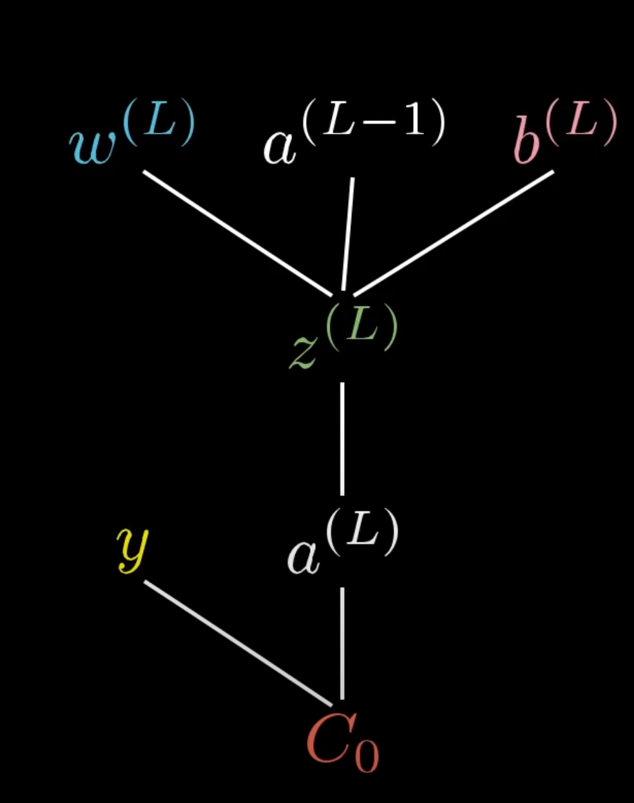

# Hierarhicno grucenje
very slow algo:
prostorska zahtevnost: `O(n2)`, casovna `O(m3)`. -> m krat racunas matriko razdalj in povezes dva najblizja primera / clusterja.
pac se da malo pohitrit da prides na `O(m2*logm)`.

### mere razdalj:

obicanjo si izberemo se kaksno napako bomo merili (razdaljo basically) al evklidsko, al manhatnsko, al..

- single linkage( razdalja med najblizjima primeroma),
    - prednost daje primerkom, ki so si blizje
    (. Single linkage je dober tudi, če so podatki zelo razpršeni in želiš izolirati skupine primerkov, ki so zelo blizu drug drugemu.)
     Uporabi to mero, če želiš detektirati grozde, ki so dolgi in ozki (npr. v obliki črke "U" ali "V").

- complete linkage(razdalja med najbolj oddaljenima primeroma),
    - prednost daje primerkom, ki so si bolj oddaljeni.
     Complete linkage je boljši za odkrivanje kroglastih in kompaktnih grozdov, saj minimizira možnost, 
     da se med seboj zelo različne skupine primerkov združijo v isti grozd.

- average linkage (povprecje razdalj med vsemi primeri), 
    - v splosnem dobra izbira in robustna izbira ali pa Wardova razdalja

# K-means
better friend, works on any size of dataset

( ful je hitrejsi ker sta obicajno K in i ful majhni stevilki, edino m je pac lahko ful velik ampak ne mors primerjat szi hierarhicnim)
cas zahtevnost O(I * k * m):
    - I je stevilo iteracij
    - k je stevilo prvih centroidov
    - m je stevilo primerov v datasetu 

### algo:
- pricni s K nakljcno izbranimi voditelji `C_1, C_2, C_k`.
- ponavljaj:
    - doloci razvrstitev C tako, da vsak primer priredis najblizjemu voditelju
    - novi voditelji naj bodo centroidi naj bodo centroidi `R_Ci`. -> `RC_i` = $$ (1 / | C_i| )* sum(x) $$

- dokler se lega voditeljev spreminja ali pac setas nek max iter ce zadeva ne konvergira.

### Izbor zacetnih voditeljev

- **Random** ( ampak lahko nas pripelje v stanje nekonvergence -> neoptimalno razbtije) 
    - Temu se izognemo tako, da postopek veckrat ponovimo in med poiskanimi razbijti izberemo najboljse.
- **Razprseni voditelji** poiscemo primer, ki je nabolj oddaljen od vsem. Potem pa poiscemo se k-1 najbolj oddaljenih  temu primeru. To bojo nasi zacetni centroidi
- **Uporabis hierarhicno na subsamplu** in potem so tej centrodi dober priblizek originalnim centroidom.


### Izracun silhuete
Ce imamo osamelca, je silhueata 0, drugace se silhueto izracuna tako:

#### Izracun silhuete za en primer
$$ s_i = \frac{(b-a) }{ max(b,a) }$$

a -> povprecna oddaljenost primera do vseh v istem clusterju
b -> povprecna oddaljenost primera do vseh v najblizjem clusterju temu, v kateremu se primer nahaja.

Ce je b zelo velik:
s => b/b => 1

a obicajno zelimo da je cimmanjsi, b pa zelimo da je cimvecji.

 -1          0           1
----------------------------
(miss) (osamelec) (centroid)

#### Izracun silhuete za celotno razbitje
S = 1 / |U|  * sum (s_i)
Basically normalizirana usota.

Hevristika ni idealna, vendar nam lahko da kaksno idejo kako se problema lotiti.
V primeru nakljucnih podatkov faila. 
Spomni se na smiley face: oci so bli en cluster, usta pa tvorila dva clusterja. Single linkage je to resil najboljse.

```python
def silhouette(el, clusters, data):
    """
    Za element el ob podanih podatkih data (slovar vektorjev) in skupinah
    (seznam seznamov nizov: ključev v slovarju data) vrni silhueto za element el.
    """
    # Find the cluster belonging to the el
    cluster = None
    for c in clusters:
        if el in c:
            cluster = c
            break

    # osamelec 
    if len(cluster) == 1:
        return 0

    # Compute the average distance to the elements in the same cluster
    a_i = 0
    for e in cluster:
        if e != el:
            a_i += cosine_dist(data[el], data[e])
    a_i /= (len(cluster) -1)

    # Compute the average distance to the elements in the closest cluster
    b_i = float("inf")
    for c in clusters:
        if c != cluster:
            b_i_per_cluster = 0
            for e in c:
                b_i_per_cluster += cosine_dist(data[el], data[e])
            b_i_per_cluster /= len(c)
            if b_i_per_cluster < b_i:
                b_i = b_i_per_cluster

    s_i = (b_i - a_i) / max(a_i, b_i)
    return s_i
```

# Razvrscanje besedil

## Elementi predstavitve besedilnih dokumentov

### k-terke znakov
k-terke za n = 2 => murskosoboski -> mu ur rs...
(na podlagi k terk, lahko razpoznamo v katerem jeziku je napisano doloceno besedilo)

### Besede (bow)
- Najprej odstranimo manj pomembne besede kot so (in, ter, ali, ..).
- Vse besede nadomestimo z njihovimi koreni ali pa lemami (lematizacija; postopek ni enostaven in je odvisen od jezika).

(namesto stetja, zaradi razlicnih dolzin dokumentov, uporabimo relativno frekvenco) drugace klasicn bow.

bow zanemarja dejstvo, da je pomen besed mnogokrat odvisen od konteksta. Taksna predsavitev nam ne bomm mogla razresiti problema
podpomenk in drugacnih povezav med razlicnimi izrazi.

### Fraze
K-terke besed, ki se v besedilu nahajajo druga ob drugi ali v bliznji okolici. (Okolico lahko doloca npr. okno zaporedja 5ih besed).
lahko jih uporabimo za bow, da dodamo nekakaksno povezavo med razlicnimi besedami.

### Uporaba oznak
Na spletu so oznaceni tudi dokumenti, pomagajo nam lahko pri treniranju modelov (idk znanstveni clanki, knjige itd).

## Ocenjevanje podobosti med dokumenti

### Transformacija tf-idf
Zaradi razlicnih dolzin dokumentov se raje zavrzemo k pojmu relativne frekvence.
Naceloma imamo raje elemente, ki se pojavijo v manj dokumentih in so zaradi tega bolj specificni.
Zato uporabimo inverse document frequency. Kjer uzamemo logaritem stevila useh dokumentov deljeno s stevilom pojavitev terma v vseh dokumentih.

$$ idf(t) = log \frac{|D|}{|d: t \in d|} $$

Utez posameznega elementa je potem:

$$ tf-idf(t, d) = tf(t, d) \times idf(t) $$

### Kosinusna podobnost
Evklidska razdalja ni gud ker meri samo razdalje v posameznih dimenzijah. Denimo da sta vektorja kratka vendar kazeta v cisto drugo smer.
Njuna razdalja bo majhna, vendar si vektorja nista niti priblizno podobna. Pa tudi ce uzamemo dva vektorja, ki kazeta v isto smer, pa je en 
zelo dolg v vseh dimenzijah. Drugi, pa ima zelo majhne vrednosti. Potem si ne bosta podobna tudi ce oba kazeta v isto smer.
(dolzina vektorja nam obicajno ne pove nic)

Zato se razje zavrzemo k kosinusni razdalji, saj raje meri kot med vektorji kakor razdaljo. Izkaze se da je to boljsa metrika za merjenje razdalj, med visoko dimenzionalnimi
vektorji. 

$$ a b = ||a|| ||b|| cos \theta $$

$$ sim(X,Y) = cos(\theta) = \frac{X Y}{||X|| ||Y||} $$

Kadar imamo opraviti z oznakami (labels) torej ne z besedami besedila, je poleg kosinusne razdalje se smiselno opazovati
tudi podobnost po Jaccardu:

```python
def jaccard(data, k1, k2):
    """jaccard similarity"""
    s1 = data[k1]
    s2 = data[k2]
    return len(s1 & s2) / len(s1 | s2)
```

$$ J(X, Y) = \frac{X \cap Y}{ X \cup Y} $$

# Projekcije in zmanjsevanje dimenzionalnosti podatkov

## PCA

pri PCAju iscemo projekcije iz visjih dimenzij v nizje, tako da ohranjamo varianco med primeri. 

Primer: Ce imamo visoko korelirane 2d primere -> potem jih lahko lepo spravimo v 1d.


$$ S = \frac{1}{m} \sum_{i=1}^{m} (x^{(i)} - \overline{x}) (x^{(i)} - \overline{x}) ^ T $$

$$ Var(u_1^T X^T) =  u_1^T S u_1 $$

Dokaz z uporabo Lagrangeovih multiplikatorjev:


predpogoj:

$$ u_1^T u_1 = 1 $$


minimiziramo:

$$ f(u_1) = u_1^T S u_1 + \lambda_1 (1 - u_1^T u_1) $$

$$ \frac{ \partial f(u_1) } {\partial u_1} = S u_1 - \lambda_1 u_1  = 0 \Rightarrow S u_1 = \lambda_1 u_1 $$

Sepravi iscemo tisti lastni vektor pri najvecji lastni vrednosti:

$$ u_1^T S u_1 = u_1^T \lambda_1 u_1 = \lambda_1 u_1^T u_1 = \lambda_1 $$

Naslednji vektor lahko najdemo tako da ta algoritem pozenemo se enkrat na podatkih katerim smo odsteli projekcijoi podatkov na prvotni dobljeni vektor.

### Potencna metoda za iskanje N prvih lastnih vektorjev

Ker je obicajno racunanje SVDja zahteven postpek se zatecemo k optimizcaijskim numericnim metodam.

Pri potencni metodi izkoristimo dejstvo, da ce prvi lastni vektor pomnozimo s kovariancno matriko, se potem vekor ne spremeni (mogoce se malo scalea), ne bo  tudi spremenil svoje orientacije(kota).
Zato najprej inicializiramo nek random vektor, ga pomnozimo s kovariancno matriko in potem ta postopek ponavljamo, dokler ne ta vektor skonvergira do ustavitvenega pogoja. Serpavi
konvergiramo takrat, ko se dolzina vektorja v koraku x ne spremeni vec veliko.

$$ | u_1 | - | u_2 | <= \epsilon $$

Pripadajoco lastno vrednost pa izracunamo na sledeci nacin:

$$ Mu = \lambda u $$

$$ u^T M u = u^T \lambda u = \lambda u^T u = \lambda $$

## MDS (vecrazredno lestvicenje)

Pri MDS iscemo ulozitve, basically iscemo taksne projekcije v nizji prostor, tako, da se razdalje med primeri ohranijo.

Kriterijsko funkcijo sepravi zastavimo takole:

$$ J(X)  = \sum_{i \neq j} (d_{ij} - \delta{ij}) ^2 $$

Kjer $ d_{ij} $ predstavlja, razdaljo med i-tim in j-tim primerom v originalmem prostoru. $ \delta_{ij}$ pa v novem nizje projeciranem prostoru.

Slabost MDS-a je to, da ze ohranjajo tudi razdalje mogoce zelo oddaljenih primerov, kar nam vizualizacijo in interpretabilnost zelo pokvari.


## t-SNE (stohasticna ulozitev sosedov)
Gre za isto metodo kot MDS, kriterijska funkcija pa je nekoliko drugacna.
Tle gledamo samo skupine ki so si blizu. Sepravi razdalje utezimo s pomocjo t-statisticne krivulje. Bolj kot so si primeri blizu, vecjo tezo imajo. Bolj kot so si oddaljeni, manjso tezo imajo.


# Linearna regresija

Kriterijska funkcija (sum of squared errors): 

$$ J(\theta) = \frac{1}{2m} \sum_{i=1}^m (h_{\theta}(x^{(i)}) - y^{(i)}) ^2 $$

Gradientni sestop:

$$ \theta_i \leftarrow \theta_i - \alpha \frac{\delta}{\delta \theta_i} J(\theta) $$

Po veriznem odvajanju pridemo do sledecega:

$$ \theta_i \leftarrow \theta_i - \frac{\alpha}{m} \sum_{j=1}^{m} (h_{\theta} (x^{(j)}) - y^{(j)}) x_i^{(j)} $$


### Napovedna tocnost

#### Regresijska

$$ \text{RMSE} = \sqrt{\frac{{\sum_{i=1}^{n} (y_i - \hat{y}_i)^2}}{n}} $$

$$ R^2 = 1 - \frac{{\sum_{i=1}^{n} (y_i - \hat{y}_i)^2}}{{\sum_{i=1}^{n} (y_i - \bar{y})^2}} $$


#### Klasifikacijska

$$ \text{Accuracy} = \frac{TP + TN}{TP + TN + FP + FN} $$

$$ \text{Specificity/TNR} = \frac{TN}{TN + FP} = \frac{TN}{N} $$

$$ \text{Sensitivity/TPR} = \frac{TP}{TP + FN} = \frac{TP}{P}$$

denimo da vse primere klasificiramo kot T potem:
TPR = 1, TNR = 0 

#### AUC


Basically sortas po verjetnostih, potem pa premikas mejo za positive.
Za vsako novo mejo poracunas za y-os: TPR, za x-os pa 1-TNR.
Koncno ROC krivuljo dobimo tako da cez tocke modeliramo kompleksno krivuljo(basically preko najboljsih tock, tako da maksimiziramo AUC).


### Polinomska regresija
Atribut x razsirimo na:

$$ x^2, x^3, x^4, ... $$

Obicajno se nam z dviganjem stopnje polinoma nas model vedno bolje prilega ucnim podatkom.

Model je se vedno linearen, saj imamo linearno kombinacijo thet, atributi nas ne zanimajo.

$$ h(x) = \theta_0 + \theta_1 x + \theta_2 x^2 + ... $$


### Regularizacija
Kriterijska funkcija (sum of squared errors) dodamo se omejitev, naj se optimizira velikost koeficientov:

#### L1 (Lasso):
$$ J(\theta) = \frac{1}{2m} \sum_{i=1}^m (h_{\theta}(x^{(i)}) - y^{(i)}) ^2  + \lambda \sum_{j=1}^{n} |\theta_j|$$

#### L2 (Ridge):
$$ J(\theta) = \frac{1}{2m} \sum_{i=1}^m (h_{\theta}(x^{(i)}) - y^{(i)}) ^2  + \frac{\lambda}{2m} \sum_{j=1}^{n} \theta^2_j$$

$$ \frac{\partial J(\theta)}{\partial \theta_j} = \frac{1}{m} \sum_{i=1}^{m} [(h_\theta(x^{(i)}) - y^{(i)}) x_j^{(i)}] + \frac{\lambda}{m} \theta_j $$

gradientni sestop:

$$ \theta_j \leftarrow \theta_j (1 - \frac{\lambda}{m}) - \frac{1}{m}\sum_{i=1}^{m} (h_{\theta}(x^{(i)}) - y^{(i)}) x_j^{(i)} $$


recimo da

$$ \lim_{\lambda \rightarrow \infty} J(\theta) $$

potem minimiziramo:

$$ (\theta_0 - y) ^2 $$

posledica:

$$ \theta_i \rightarrow 0, \forall i=1, \dots n $$

$$ \theta_0 \rightarrow \frac{1}{n} \sum_{i=1}^m y^{(i)}, \text{povprecna vrednost koncne spremenljivke}$$ 

Razlika pri obeh je da Lasso bo spravil nekatere koeficente na cisto 0, Ridge-ovi koeficienti pa ne bodo nikoli cisto na nic. Samo blizu (zaradi kriterija).

# KNN za regresijo

Leno ucenje. Izracunas razdalje iskanega primera z vsemi v train mnozici. Uzames k najblizjih ter averageas njihove vrednosti.

Tipicno se uporablja k=10, ali 

$$ k = \sqrt{n} \text{, kjer je n stevilo vseh primerov v datasetu} $$


# Regresijska drevesa

Train set je zacetna mnozica. Potem to mnozico delimo:
tako da gremo najprej cez vse atribute in cez vse mozne vrednosti praga, da dobimo cimanjso residualno napako pri delitvi.
Basically napoved je potem mean value subseta iz train seta.

$$ \epsilon_1 = \frac{\sum_{i=0}^{k_1} ( y^{(i)} - \overline{y})^2} {k_1} $$

$$ \epsilon_{RES} = \frac{k_1}{n} \epsilon_1 + \frac{k_2}{n} \epsilon_2 $$


Delimo dokler 

$$ \epsilon_{RES} < \epsilon $$

Prednosti:
- Dobra interpretacija (gledas pac kaksne atribute je uporabilo v vozliscih)
- Hitrost napovedovanja, globje kot gremo, kompleksnost pada
- Odkrivanje interakcij

Slabosti:
- nestabilnost (visoka varianca), ce spremenimo en primer, se lahko struktura drevesa cisto spremeni.


## Regresijski gozdovi
Namesto ene hipoteze gradimo N hipotez. Koncna napoved je povprecje napovedi N dreves. Vsako drevo ima isto glasovalno pravico.
Obicajno train mnozico za grajenje dreves vzorcimo po metodi stremena (bootstraping). Serpavi en vzorec se lahko veckrat pojavi noter.
Zadevo lahko se dodatno ponakljucimo. Tako da med izracunom rezidualne napake izberemo nekaj najboljsih atributov ter vzorcimo se iz tega.
Kar vkljuci dodatno varianco, vendar ne pokvari predikcij. (to je zlo powerfull metoda).

$$ \hat{y}^{(i)} = \sum^{N}_{j=1} \frac{h_{\theta, j} (x^{(i)})}{N} $$


# Logisticna regresija (klasifikacija)

Obicajno nas poleg klasifikacije zanima se verjetnost pripadnosti razreda. Pri tem si pomagamo z logisticno regresijo.


$$ h_{\theta} (x) = g(\theta^T x) = \frac{1}{1 + e^{-\theta^T x}} = \frac{1}{1 + e^{-\sum_{i=0}^m \theta_i x_i}} $$

### Logisticna funkcija

$$ g(z) = \frac{1}{1 + e^{-z}} $$

$$ \frac{dg(z)}{dz} = g(z) * (1-g(z)) $$


### Verjetje

$$ P(y=1 | x; \theta) = h_{\theta}(x) $$

$$ P(y=0 | x; \theta) = 1 - h_{\theta}(x) $$

splosno:

$$ P(y | x; \theta) = (h_{\theta}(x))^y  (1 - h_{\theta}(x))^{1-y} $$

definirajmo kriterijsko funkcijo za verjetje:

$$ L(\theta) = \prod^{m}_{i=1} h_{\theta} (x^{(i)})^{y^{(i)}} ( 1 - h_{\theta} (x^{(i)}))^{1-y^{(i)}} $$

cilj je maksimizirati verjetje:

$$ \theta^{*} = argmax_{\theta} L(\theta) $$

Zaradi lazjega odvajanja ter numericnih aproksimacij, funkcijo transformiramo v utezeno vsoto logaritmicnega verjetja.

$$ l(\theta) = \sum_{i=1}^{m} y^{(i)} \log h_{\theta}(x^{(i)}) + (1 - y^{(i)}) \log (1 - h_{\theta}(x^{(i)})) $$

$$ \frac{\partial l(\theta)}{\partial \theta_j} = \sum^{m}_{i=1} (y^{(i)} - h_{\theta} (x^{(i)}) ) x_j^{(i)} $$

potem lahko izvedemo gradientni dvig (zelimo maksimizirati verjetje)

$$ \theta \leftarrow \theta + \alpha \bigtriangledown_{\theta} l(\theta) $$

## Vpeljava regularizacije

$$ J'(\theta) = J(\theta) - \frac{\lambda}{2m} \sum \theta_j^2 $$

gradientni dvig:

$$ \theta \leftarrow \theta (1 - \alpha \frac{\lambda}{m}) +  \alpha \bigtriangledown_{\theta} l(\theta)   $$


# Softmax regresija
Gre za posplositev logisticne regresije na vec razredov (za k=2 dobimo logisticno regresijo).

$$ z = [2, 4, 7, 10] ^ T $$

$$ P( y_k^{(i)} | x^{(i)}; \theta) = \frac{e^{z^{(i)}}}{\sum e^{z^{(i)}}} $$

Kar je nice o softmax regresiji je to, da lahko outpute poljubnega modela predstavimo z vrjetnostmi.
Obicajno lahko izpeljemo tudi kriterijsko funkcijo s pomocjo tega pravila. + vektorizirat se da.


# Naivni Bayes

$$ P(A | B) = \frac{P(B|A) P(A)}{P(B)} $$

$$ p(e|x) = p(e) \frac{p(x|e)}{p(x)} $$

$$ p(e|x) \text{ - posteriorna verjetnost} $$

$$ p(e) \text{ - apriorna verjetnost} $$

$$ p(x) \text{ - brezpogojna verjetnost}  $$

$$ p(x|e) \text{ - verjetje} \Rightarrow  \text{Predposravimo neodvisnost atributov pri danem razredu} \Rightarrow \prod p(x^{(i)} | e) $$

#### Lastnosti
- Je statisticni model, ki predpostavi, da so posamezni atributi medseboj neodvisni
- Hiter za treniranje (enkrat gres skoz dataset, poracunas verjetnosti in to je to)
- Predstavimo ga lahko z nomogrami
- Dobro deluje z visoko dimenzionalnimi podatki (kakor je text naprimer, pred velikimi language modeli se je uporabljal za nlp)
- Handla missing vrednosti, tako, da jih preprosto izpusti

# Nevronske mreze
- [globoke nevronske mreze](https://www.youtube.com/watch?v=FBpPjjhJGhk)
- [konvolucijske nevronske mreze](https://www.youtube.com/watch?v=8iIdWHjleIs)
- [backprop 3b1b, chapter4](https://www.youtube.com/watch?v=aircAruvnKk&list=PLZHQObOWTQDNU6R1_67000Dx_ZCJB-3pi)


#### Backprop



$$ \frac{\partial C_0}{ \partial w^{(L)}} = \frac{\partial z^{(L)}}{\partial w^{(L)}} \frac{\partial a^{(L)}}{\partial z^{(L)}} \frac{\partial C_0}{\partial a^{(L)}} $$

### SHAP


# Priporocilni sistemi

### Racunanje podobnosti med uporabniki
- evklidska razdalja
- kosinusna razdalja (ce imamo zvezne ocene). Najde nam podobnosti glede na kot med vektorjema, sepravi scale ocen ni vazen ;).
- podobnost po Jaccardu (ce imamo diskretne ocene (T/F)) 

### Priporocila na podlagi uporabniskih profilov in podobnosti med uporabniki
Za danega uporanika u zelimo z uporabo ucnih podatkov oceniti, kaksna je njegova preferencna ocena za stvar i.
Za izdelek i, gremo skozi use uporabnike, ki so ta izdelek ocenili. Oceno usakega uporabnika utezimo s razdaljo do iskanega uporabnika, ter normirmo z vsoto vseh utezi.

$$ r_{ui} = \frac{\sum s(u, u') \times r_{u'i}}{\sum s(u, u')} $$


### Priporocila na podlagi profilov stvari in podobnosti med stvarmi
Ta izracun je na moc podoben izracunu iz prejnsega razdelka, le da tu utezimo ocene nasega ciljnega uporabnika, v prejnsem razdelu pa smo utezili ocene ostalih uporabnikov.

$$ r_{ui} = \frac{\sum s(i, i') \times r_{ui'}}{\sum s(i, i')} $$

### Priporocanje na podlagi podobnosti uporabnikov in stvari
Zdruzimo prejsni tehniki. Sepravi podobnosti med uporabniki ter podobnosti med stvarmi, ki jih je uporabnik ze ocenil.
Tehnika je kul, vendar je njena casovna zahtevnost zelo velika. Saj rabimo iti skozi vse stvari in vse uporabnike.

$$ r_{ui} = \frac{\sum s(u, u') \times s(i, i') \times r_{ui'}}{\sum s(i, i') \times s(u, u') } $$

### "Priporocanje kar tako"
Uporabniku damo povprecno oceno vseh uporabnikov za ta izdelek.

###  Kako se izognemo pristranosti uporabniskih ocen?
Nekateri uporabniki bolj vedre narave ocenljevali z visijimi ocenami, nekateri bodo pa dajali ekstremno visoke ocene.
Problemu pristranosti uporabnikov se lahko delno izognemo tako, da pred ucenjem vsem uporabnikom odstejemo povprecno
oceno uporabnika. In jo potem pri napovedi pristejemo.

### Kako ucimo in ocenjujemo
Cros validation, R2 ocena in RMSE ocena. Podobno kot pri regresijskih problemih.

### Matricni razcep

Imamo matriko uporabnikov in njihove ocene za izdelke.

```bash
| -  A  B  C  D  E |
| U1 4  -  -  2  2 |
| U2 -  5  3  1  - |
| U3 2  -  -  3  - |
| U4 1  1  -  5  3 |
| U5 5  -  5  -  4 |
```

To matriko razcepimo tako, da je k << n in k << m.

```bash
R matrix (m x n):

| r11 r12 r13 ... r1n |
| r21 r22 r23 ... r2n |
|  .   .   .  ...  .  |
|  .   .   .  ...  .  |
|  .   .   .  ...  .  |
| rm1 rm2 rm3 ... rmn |

P matrix (m x k):

| p11 p12 ... p1k |
| p21 p22 ... p2k |
|  .   .  ...  .  |
|  .   .  ...  .  |
|  .   .  ...  .  |
| pm1 pm2 ... pmk |

Q matrix (k x n):

| q11 q12 q13 ... q1n |
| q21 q22 q23 ... q2n |
|  .   .   .  ...  .  |
| qk1 qk2 qk3 ... qkn |
```

Uporabniski deskriptor (stvari so skompresirane; v primeru netflixa, niso vec filimi ampak bol kategorije ze npr. science fiction, komedije,...):
$$ p_u = [p11, p12, \dots, p1k] $$

Deskriptor stvari(ocene uporabnikov so skompresirane):
$$ q_i = [q13, q23, \dots, qk3] $$

Iz analize P pa Q matrik, bi lahko tudi izvedeli kaksni so tipicni uporabniki in tipicne stvari, ki spadajo v iste skupine.

Oceno uporabnika iz P in Q matrik potem izracunamo kot produkt:

$$ r_{ui} = \sum_{k=1}^{K} p_{uk} q_{ki} $$

ali vektorsko:

$$ r_{ui} = p_u q_i $$

Kriterijska funkcija (samo za primere, ki so na voljo v originalni matriki):

$$ e_{ui}' = \frac{1}{2} (r_{ui} - r_{ui}')^2 $$

$$ = \frac{1}{2} (r_{ui} - \sum_{k=1}^{K} p_{uk} q_{ki}) $$

Potem lahko odvajamo kriterijsko funkcijo po p in q:

$$ \frac{\partial e_{ui}}{\partial p_{uk}} = -e_{ui} q_{ki} $$

$$ \frac{\partial e_{ui}}{\partial q_{ki}} = -e_{ui} p_{uk} $$

### Algoritem za aproksimacijo P pa Q matirke (stohasticni gradientni sestop):
Stohasticni - vsak primer posebej obravnavamo in ne hkrati celotne matrike P pa Q

```
P, Q inicializiramo z nakljucnimi vrednostmi na intervalu [-0.001, ..., 0.001]
do konvergence:
    za vse (u, i) v ucni mnozici:
        za k=1...k:
            p_uk <- p_uk + alpha * e_ui * q_ki
            q_ki <- q_ki + alpha * e_ui * p_uk
```

konvergenca:
- stevilo iteracij
- ni sprememb po K korakih iteracije (na train ali prefreably test setu)

### Regularizacija
Kot pri metodah do sedaj, skusamo minimizirati se koeficente modela.
Pri veliko podatkih in majhinh modelih, nima velikega upliva. Je pa fajn ce mamo malo podatkov.

$$ e_{ui}' = \frac{1}{2} (e_{ui}^2 + \lambda p_u p_u^T + \lambda q_i q_i^T) $$

odvod:

$$ \frac{\partial e_{ui}}{\partial p_{uk}} = -e_{ui} q_{ki} + \lambda p_{uk} $$

$$ \frac{\partial e_{ui}}{\partial q_{ki}} = -e_{ui} p_{uk} + \lambda q_{ki} $$

### Pristranost
Nastavis stolpce/vrstice na 1.


# Povezovalna pravila in pogosti nabori stvari
V primeru iskanja podobnih vzorcev v transakcijah hitro naletimo na ogromne casovne zahtevnosti.
Zato je potrebno uvesti razne hevristike.

## Algoritem apriori (pogosti nabori stvari)

definirajmo funkcijo, ki steje ali je podmnozica usebovana v neki mnozici:

$$ \sigma(X)=|\{t_i|X\subseteq t_i, t_i\in {\mathcal T}\}| $$


Potem lahko izracunamo delez podprtih transakcij:

$$ \sigma(X)=|\{t_i|X\subseteq t_i, t_i\in {\mathcal T}\}| $$

zanima nas: 

$$ s(X)\geq{\rm minsupp} $$

minsupp doloci uporabnik algoritma.


#### Teoremi, ki veljajo za algoritem apriori

- Ce je nabor pogost, so pogoste tudi vse njegove podmnozice:

$$ s(X)\geq{\rm minsupp}\implies s(Y)\geq{\rm minsupp}, Y\subseteq X $$ 

- ce je nabor nepogost, so nepogosti tudi vsi nabori, ki ga vsebujejo:

$$s(X)<{\rm minsupp}\implies s(Y)<{\rm minsupp}, X\subseteq Y$$


Tukaj na sliki imamo primer algoritma apriori, vidimo, da visoko kombinatoricni prostor lahko rezemo s pomocjo hevristike minsupp, ter z uporabo zgornjih  teoremov.
Prostor iskanja je zelo zmanjsan, kar nam pohitri casovno zahtevnost in naredi algoritem dejansko uporaben.


## Povezovalna pravila
Tukaj gledamo kdaj se nam nek element pojavi skupaj z se enim drugim (npr u nakupovalni kosarici, ko kupimo mleko kupimo pogosto se moko zraven)

Ce X potem Y:

$$ X \rightarrow Y, X \cap Y \neq 0 $$

Podporo tukaj merimo z pogostostjo tega pravila v ucni mnozici (mnozici transakcij)

$$ s( X \rightarrow Y) = \frac{\sigma(X \cup Y)}{N} $$

Zaupanje:

$$ c( X \rightarrow Y) = \frac{\sigma(X \cup Y)}{\sigma(X)} $$


Kako pa zgleda algoritem? Ja najprej gremo skozi algoritem apriori, dobimo mnozice, ki ustrezajo minsuppu.
Naslednji korak je oceniti zaupanje, zacnemo iz najvecjih mnozic:


